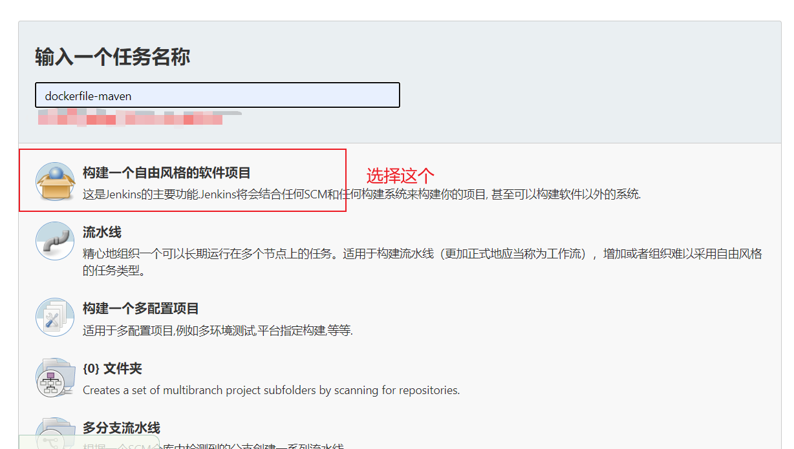
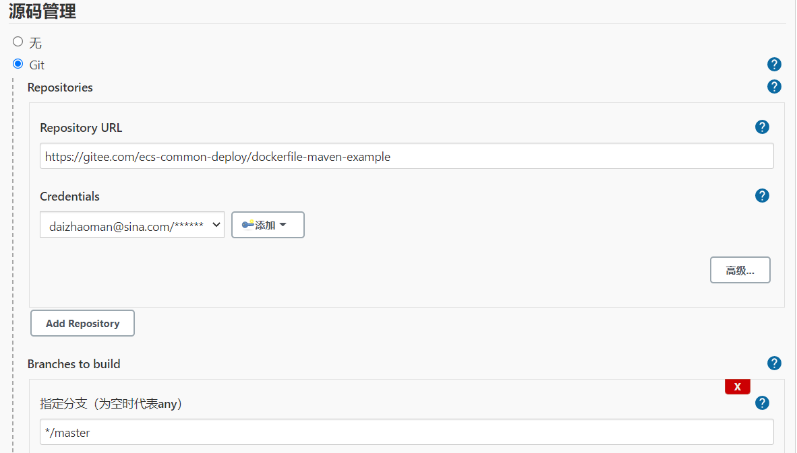
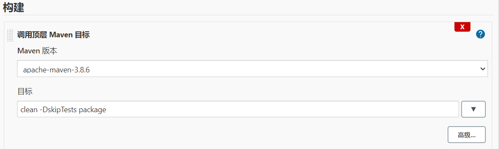
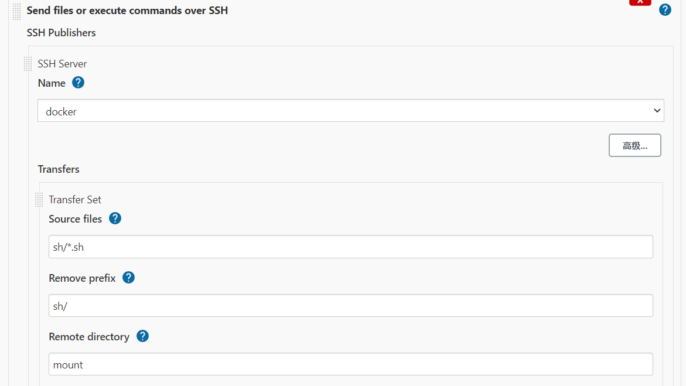
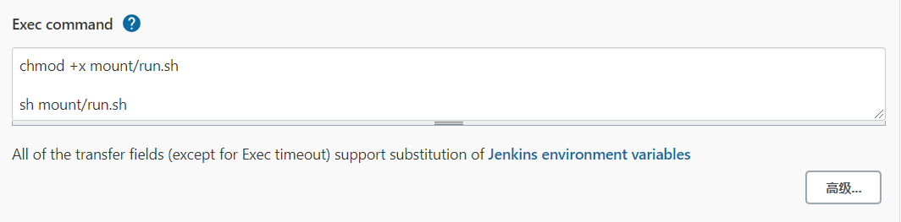

# 基于jenkins容器部署SpringBoot应用构建镜像(基于Dockerfile+Maven插件构建)

## 简介

本示例是使用jenkins容器 部署SpringBoot应用 ，应用是基于Dockerfile+Maven插件构建的镜像。

采用jenkins容器自动安装java环境（如果jenkins自动jdk版本与开发版本兼容，可以不用设置）、maven环境的方式。

## 环境搭建

[docker安装jenkins](../install/docker-install-jenkins.md)

## 项目构建

[基于Dockerfile+Maven插件为SpringBoot应用构建镜像（推荐）](docker-dockerfile-maven-springboot-advanced.md)

## jenkins配置参考

初始化向导配置

[Jenkins配置&插件安装&项目构建实战演示](https://github.com/tuonioooo/engineering-management/blob/master/jenkins-ji-cheng/Jenkins%E9%85%8D%E7%BD%AE&%E6%8F%92%E4%BB%B6%E5%AE%89%E8%A3%85&%E9%A1%B9%E7%9B%AE%E6%9E%84%E5%BB%BA%E5%AE%9E%E6%88%98%E6%BC%94%E7%A4%BA.md)

当前项目部署配置

* 新建项目

* 源码管理

* 构建

## 演示项目地址

[https://gitee.com/ecs-common-deploy/dockerfile-maven-example.git](https://gitee.com/ecs-common-deploy/dockerfile-maven-example.git)

