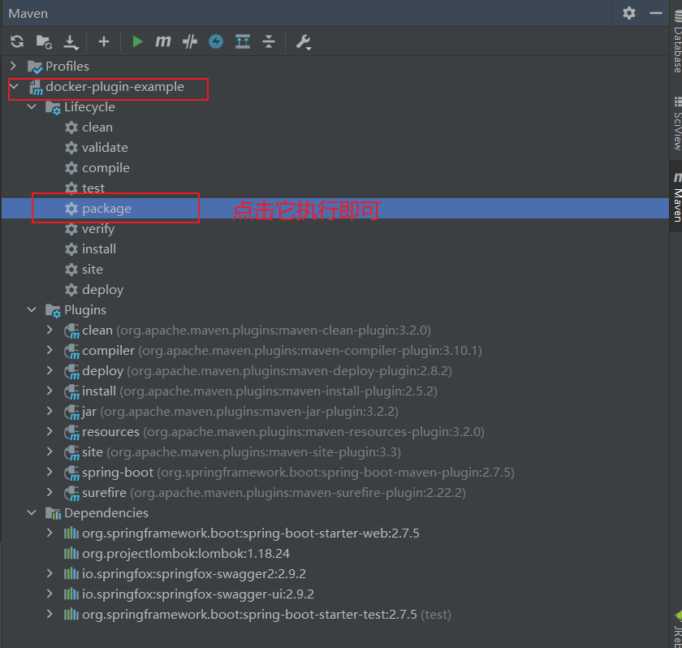
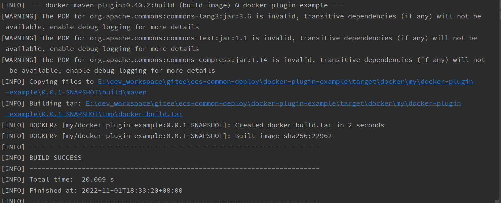
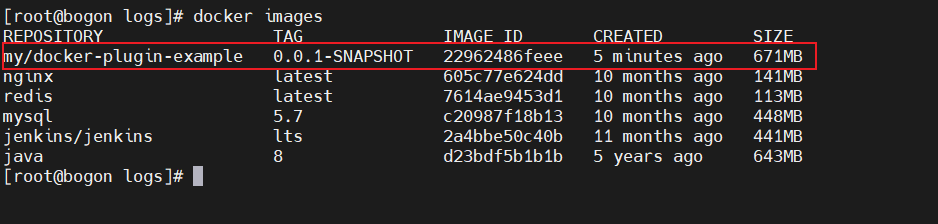
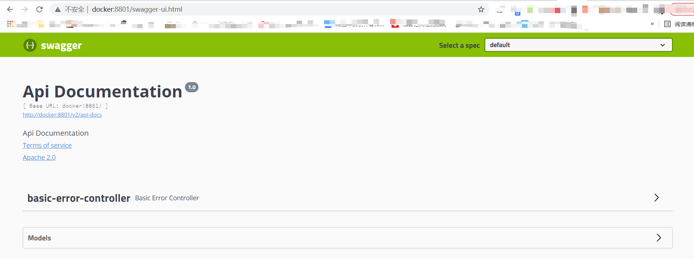

# Maven插件构建SpringBoot镜像（二）

## 简介
本示例，构建镜像依赖插件如下

```xml
<plugin>
  <groupId>io.fabric8</groupId>
  <artifactId>docker-maven-plugin</artifactId>
  <version>0.40.2</version>
<plugin>
```

推荐提前到 docker主机上拉取镜像避免本机打包镜像超时 `docker pull java:8`

## docker开启远程API
#### 用vim编辑器修改docker.service文件
```shell
vi /usr/lib/systemd/system/docker.service
```

#### 需要修改的部分
```shell
ExecStart=/usr/bin/dockerd -H fd:// --containerd=/run/containerd/containerd.sock
```

#### 修改后
```shell
ExecStart=/usr/bin/dockerd -H fd:// --containerd=/run/containerd/containerd.sock -H tcp://0.0.0.0:2375 -H unix://var/run/docker.sock
```

> [!NOTE]
>
> 在 `ExecStart=/usr/bin/dockerd -H fd:// --containerd=/run/containerd/containerd.sock` 命令后追加了
>
>  `-H tcp://0.0.0.0:2375 -H unix://var/run/docker.sock`

#### 修改配置后需要使用如下命令使配置生效
```shell
systemctl daemon-reload
systemctl stop docker
systemctl start docker
```

#### 开启防火墙的docker构建端口
```shell
firewall-cmd --zone=public --add-port=2375/tcp --permanent
firewall-cmd --reload
```

## maven构建docker镜像
#### `pom.xml` 文件中添加 `docker-maven-plugin` 依赖
```xml
<build>
    <plugins>
        <plugin>
            <groupId>org.springframework.boot</groupId>
            <artifactId>spring-boot-maven-plugin</artifactId>
            <configuration>
                <excludes>
                    <exclude>
                        <groupId>org.projectlombok</groupId>
                        <artifactId>lombok</artifactId>
                    </exclude>
                </excludes>
            </configuration>
        </plugin>
        <!--配置docker打包插件-->
        <plugin>
            <groupId>io.fabric8</groupId>
            <artifactId>docker-maven-plugin</artifactId>
            <version>${docker.maven.plugin.version}</version>
            <executions>
                <!--如果想在项目打包时构建镜像添加 `mvn clean -DskipTests package` 会同时构建镜像 -->
                <!--执行 mvn package 时 自动 执行 mvn docker:build-->
                <execution>
                    <id>build-image</id>
                    <phase>package</phase>
                    <goals>
                        <goal>build</goal>
                    </goals>
                </execution>
            </executions>
            <configuration>
                <!-- Docker 远程管理地址-->
                <dockerHost>${docker.host}</dockerHost>
                <images>
                    <image>
                        <!--定义镜像名称-->
                        <name>my/${project.name}:${project.version}</name>
                        <!--定义镜像构建行为-->
                        <build>
                            <!--定义基础镜像-->
                            <from>java:8</from>
                            <!-- 定义参数 -->
                            <args>
                                <JAR_FILE>${project.build.finalName}.jar</JAR_FILE>
                            </args>
                            <!--定义哪些文件拷贝到容器中-->
                            <assembly>
                                <!--定义拷贝到容器的目录-->
                                <targetDir>/</targetDir>
                                <!--只拷贝生成的jar包-->
                                <descriptorRef>artifact</descriptorRef>
                            </assembly>
                            <!--定义容器启动命令-->
                            <entryPoint>["java", "-jar","/${project.build.finalName}.jar"]</entryPoint>
                            <!--定义维护者-->
                            <maintainer>tuonioooo</maintainer>
                        </build>
                    </image>
                </images>
            </configuration>
        </plugin>
    </plugins>
</build>
```

使用IDEA工具中的maven插件打包项目并构建镜像上传到docker服务器地址



构建成功



docker服务器地址（我的是192.168.217.143）, 查看结果



启动docker

```shell
$ mkdir -p /mount/apps/docker-plugin-example/logs
$ docker stop docker-plugin-02
$ docker rm docker-plugin-02

#删除空悬镜像（dangling images）
$ docker rmi $(docker images -f "dangling=true" -q)

$ docker run -p 8801:8801 --name docker-plugin-02 \
  -v /etc/localtime:/etc/localtime \
  -v /mount/apps/docker-plugin-example/logs:/logs \
  -d my/docker-plugin-example:0.0.1-SNAPSHOT
```

进行访问测试，地址：[http://192.168.217.144:8801/swagger-ui.html](http://192.168.217.144:8801/swagger-ui.html)



## 演示项目地址
[ecs-common-deploy/docker-plugin-example](https://gitee.com/ecs-common-deploy/docker-plugin-example.git)

> [!WARNING]
>
> pom_fabric8.xml: 为当前示例的pom文件，运行时请替换到pom.xml中

