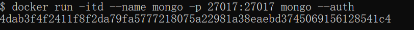
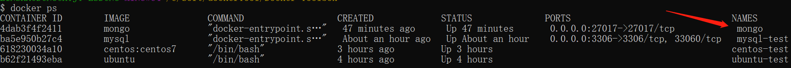
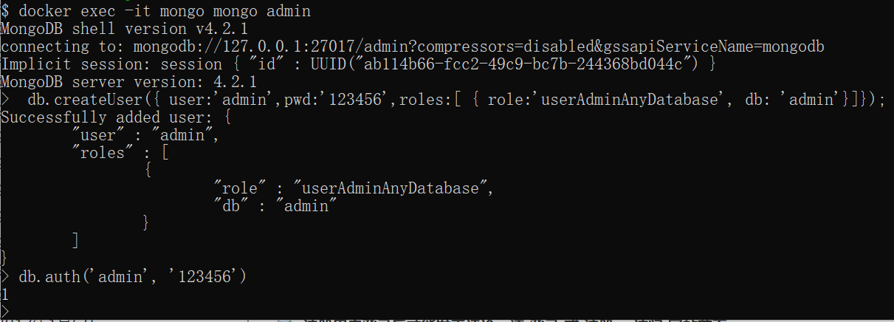

# Docker MongoDB进阶配置

### 进阶一
安装完成后，我们可以使用以下命令来运行 mongo 容器：

```shell
docker run -itd --name mongo -p 27017:27017 mongo --auth
```

> [!NOTE]
>
> **参数说明：**
>
> + **-p 27017:27017** ：映射容器服务的 27017 端口到宿主机的 27017 端口。外部可以直接通过 宿主机 ip:27017 访问到 mongo 的服务。
> + **mongo**: 镜像名称
> + **--auth**：需要密码才能访问容器服务。



最后我们可以通过 **docker ps** 命令查看容器的运行信息：



接着使用以下命令添加用户和设置密码，并且尝试连接。

```shell
docker exec -it mongo mongo admin
# 创建一个名为 admin，密码为 123456 的用户。
>  db.createUser({ user:'admin',pwd:'123456',roles:[ { role:'userAdminAnyDatabase', db: 'admin'},"readWriteAnyDatabase"]});
# 尝试使用上面创建的用户信息进行连接。
> db.auth('admin', '123456')
```



