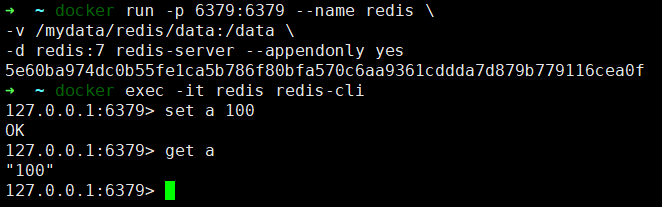

# Docker redis进阶配置

### 进阶一

#### 使用如下命令启动Redis服务

```shell
docker run -p 6379:6379 --name redis \
-v /mydata/redis/data:/data \
--restart=always \
-d redis redis-server --appendonly yes
```

:::color1
**参数说明：**

-p 6379:6379 ：将容器端口号映射到主机端口号

--name redis ：设置容器的名称

-v /mydata/redis/data:/data: 将容器data文件夹映射到主机/mydata/redis/data

redis-server --appendonly yes： 在容器执行redis-server启动命令，并打开redis持久化配置

--restart=always： 随docker启动而启动

:::

进入Redis容器使用`redis-cli`命令进行连接：

```shell
docker exec -it redis redis-cli
```



#### 设置requirepass密码启动redis
如果容器存在先停止，删除

```shell
[root@localhost ~]# docker ps
CONTAINER ID   IMAGE     COMMAND                  CREATED         STATUS         PORTS                                       NAMES
95b48053b264   redis     "docker-entrypoint.s…"   4 minutes ago   Up 4 minutes   0.0.0.0:6379->6379/tcp, :::6379->6379/tcp   redis
8b53d2a04272   nginx     "/docker-entrypoint.…"   10 hours ago    Up 10 hours    0.0.0.0:8080->80/tcp, :::8080->80/tcp       nginx-test

[root@localhost ~]# docker stop redis
[root@localhost ~]# docker rm redis
```

启动redis容器

```shell
docker run -p 6379:6379 --name redis \
-v /mydata/redis/data:/data \
--restart=always \
-d redis redis-server --appendonly yes --requirepass '123456'
```

:::color1
**参数说明：**

--requirepass '123456' ：设置认证密码

...其他类似参数参考上方示例

:::

用密码登录容器

```shell
docker exec -it redis redis-cli -a 123456
或者
docker exec -it redis redis-cli -h 127.0.0.1 -p 6379 -a 123456
```

:::color1
**参数说明：**

+ -h 127.0.0.1 ：设置主机地址（默认为本机）
+ -p 6379 ：端口号设置（默认为6379） #默认不加为 -p 6379
+ -a 123456 ：redis 认证密码 通常来讲不在这里输入 而是进入到客户端后输入，这样输入不安全，使用如上命令会有提示：`Warning: Using a password with '-a' or '-u' option on the command line interface may not be safe.`

:::

登录时不带密码、进入redis-cli 使用 auth 认证密码

```shell
[root@localhost ~]# docker exec -it redis redis-cli
127.0.0.1:6379> set name allen
(error) NOAUTH Authentication required.
127.0.0.1:6379> auth 123456
OK
127.0.0.1:6379> set name allen
OK
127.0.0.1:6379> get name
"allen"
```

