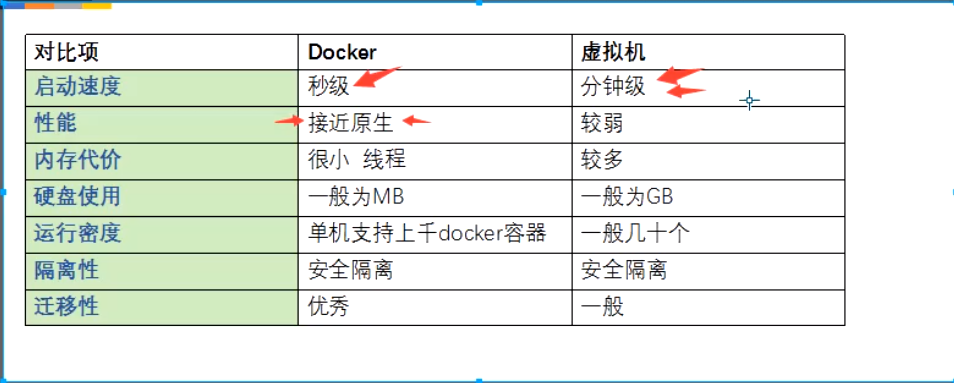

# 什么是容器？

想象一下，你正在开发一个现象级的 Web 应用程序，它由三个主要组件组成：一个 React 前端、一个 Python API 和一个 PostgreSQL 数据库。如果你想在这个项目上工作，你需要安装 Node.js、Python 和 PostgreSQL。

### **问题来了**
1. **如何确保你使用的版本与团队其他开发者一致？**  
或者与你的 CI/CD 系统以及生产环境一致？
2. **如何确保你的应用所需的 Python（或 Node.js、数据库）版本不会受到你电脑上已有版本的影响？**  
如何避免版本冲突？

### **这时候容器就登场了！**
简单来说，容器就是为你的应用程序的每个组件提供的独立隔离的运行环境。例如：

+ 前端 React 应用运行在一个容器中。
+ Python API 引擎运行在另一个容器中。
+ 数据库运行在第三个容器中。

这些容器相互独立，且与主机系统隔离。

### **容器的优势**
1. **自包含（Self-contained）**  
每个容器都包含了其正常运行所需的一切，不依赖主机上预装的任何依赖。
2. **隔离性（Isolated）**  
容器之间相互隔离，与主机系统的交互也非常有限，从而提升了应用的安全性。
3. **独立性（Independent）**  
每个容器都可以独立管理。删除一个容器不会影响其他容器。
4. **可移植性（Portable）**  
容器可以运行在任何地方！开发机上运行的容器可以在数据中心、云端或其他地方完全一样地运行。

---

### **容器与虚拟机（VM）的区别**
不深入细讲的话，虚拟机包含一个完整的操作系统，包括内核、硬件驱动程序、程序和应用。  
启动一个虚拟机来隔离一个应用，资源开销很大。

而容器只是一种隔离的进程，拥有其运行所需的所有文件。多个容器共享同一个内核，因此可以在更少的硬件资源上运行更多应用。

---

### **容器与虚拟机结合使用**
在很多场景下，容器和虚拟机会一起使用。  
例如：在云环境中，通常会先创建虚拟机（VM）作为基础设施，但不会每个虚拟机只运行一个应用。  
通过在虚拟机中运行容器，你可以运行多个容器化的应用程序，从而提高资源利用率并降低成本。

---

简而言之，容器为开发者和运维人员提供了一个更轻量、更高效的解决方案，可以更方便地管理和部署应用程序。

