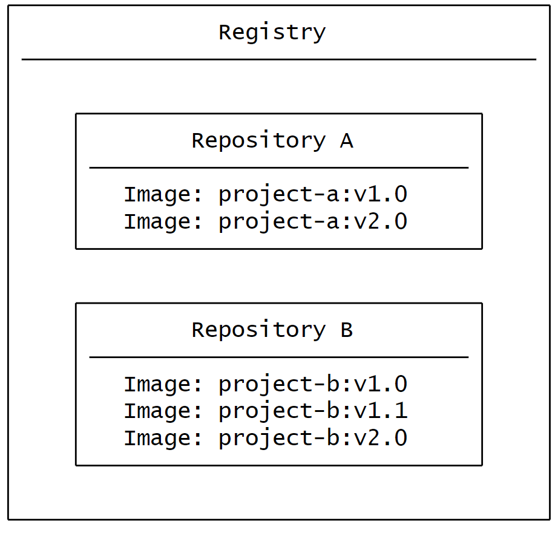

# 什么是仓库？

仓库是一个**集中化的存储与共享容器镜像的地方**，可以是**公开的**或**私有的**。

+ **Docker Hub** 是一个公开仓库，任何人都可以使用，它也是 Docker 的默认仓库。

虽然 Docker Hub 是最受欢迎的选择，但还有许多其他容器仓库，包括：

+ **Amazon Elastic Container Registry (ECR)**
+ **Azure Container Registry (ACR)**
+ **Google Container Registry (GCR)**

此外，你还可以在本地或企业内部搭建一个私有仓库，例如：

+ **Harbor**
+ **JFrog Artifactory**
+ **GitLab 容器仓库**

### **仓库（Registry）与存储库（Repository）**
在使用镜像仓库时，你可能会听到“仓库”和“存储库”这两个术语，有时它们似乎可以互换使用，但实际上它们有细微的区别：

1. **仓库（Registry）**  
是存储和管理容器镜像的**集中化位置**。
2. **存储库（Repository）**  
是仓库中**相关镜像的集合**。  
你可以将其视为一个文件夹，用于根据项目组织镜像。每个存储库可以包含一个或多个容器镜像。

### **关系示意图**
镜像仓库的结构可以理解为以下关系：

+ **仓库（Registry）** 是顶层，负责管理和存储多个项目。
+ **存储库（Repository）** 是项目的集合，用于存储具体镜像版本。
+ **镜像（Image）** 是存储库中的实际内容，可以包含多个不同的版本（如 v1、v2 等）。

