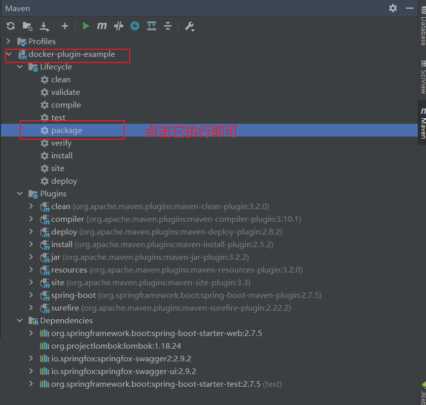
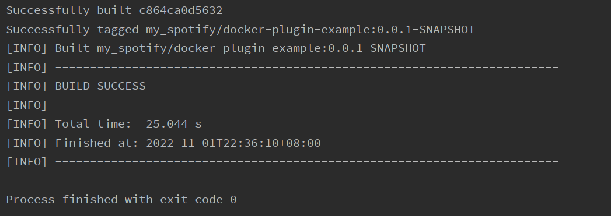
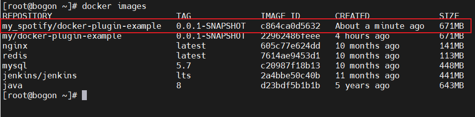
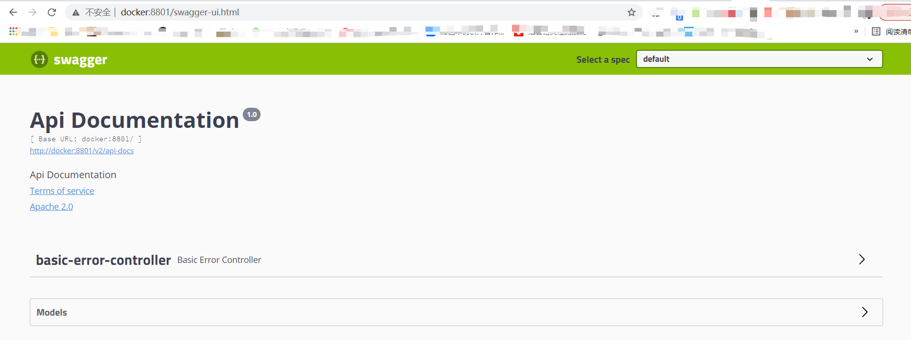

# 基于Maven插件为SpringBoot应用构建镜像（一）

## 简介

本示例，构建镜像依赖插件如下

```git
<plugin>
    <groupId>com.spotify</groupId>
    <artifactId>docker-maven-plugin</artifactId>
    <version>0.4.13</version>
<plugin>
```
 
推荐提前到 docker主机上拉取镜像避免本机打包镜像超时 `docker pull java:8`

## docker开启远程API

#### 用vim编辑器修改docker.service文件

```
vi /usr/lib/systemd/system/docker.service
```

#### 需要修改的部分

```
ExecStart=/usr/bin/dockerd -H fd:// --containerd=/run/containerd/containerd.sock
```

#### 修改后

```
ExecStart=/usr/bin/dockerd -H fd:// --containerd=/run/containerd/containerd.sock -H tcp://0.0.0.0:2375 -H unix://var/run/docker.sock
```

> 说明: 
> 其实就是在 `ExecStart=/usr/bin/dockerd -H fd:// --containerd=/run/containerd/containerd.sock` 命令后追加了 `-H tcp://0.0.0.0:2375 -H unix://var/run/docker.sock`

#### 修改配置后需要使用如下命令使配置生效

```
systemctl daemon-reload
systemctl stop docker
systemctl start docker
```

#### 开启防火墙的docker构建端口

```
firewall-cmd --zone=public --add-port=2375/tcp --permanent
firewall-cmd --reload
```

## maven构建docker镜像

#### `pom.xml` 文件中添加 `docker-maven-plugin` 依赖

```
<build>
    <plugins>
        <plugin>
            <groupId>org.springframework.boot</groupId>
            <artifactId>spring-boot-maven-plugin</artifactId>
            <configuration>
                <excludes>
                    <exclude>
                        <groupId>org.projectlombok</groupId>
                        <artifactId>lombok</artifactId>
                    </exclude>
                </excludes>
            </configuration>
        </plugin>
        <!--配置docker打包插件-->
        <plugin>
            <groupId>com.spotify</groupId>
            <artifactId>docker-maven-plugin</artifactId>
            <version>1.1.0</version>
            <executions>
                <!--执行 mvn package 时 自动 执行 mvn docker:build-->
                <execution>
                    <id>build-image</id>
                    <phase>package</phase>
                    <goals>
                        <goal>build</goal>
                    </goals>
                </execution>
            </executions>
            <configuration>
                <imageName>my_spotify/${project.name}:${project.version}</imageName> <!--镜像名称-->
                <baseImage>openjdk:8-jdk-alpine</baseImage><!--基础镜像-->
                <dockerHost>http://192.168.217.144:2375</dockerHost><!--docker 服务器ip 地址-->
                <entryPoint>["java", "-jar", "/${project.build.finalName}.jar"]</entryPoint><!--docker 启动时，会执行改命令数组-->
                <forceTags>true</forceTags><!--覆盖已存在的标签 镜像-->
                <resources>
                    <resource>
                        <targetPath>/</targetPath>
                        <directory>${project.build.directory}</directory>
                        <include>${project.build.finalName}.jar</include>
                    </resource>
                </resources>
            </configuration>
        </plugin>
    </plugins>
</build>
```
> 相关配置说明：  
> * executions.execution.phase:此处配置了在maven打包应用时构建docker镜像;
> * imageName：用于指定镜像名称;
> * dockerHost：打包后上传到的docker服务器地址;
> * baseImage：该应用所依赖的基础镜像，此处为java;
> * entryPoint：docker容器启动时执行的命令;
> * forceTags： 覆盖已存在的标签 镜像
> * resources.resource.targetPath：将打包后的资源文件复制到该目录;
> * resources.resource.directory：需要复制的文件所在目录，maven打包的应用jar包保存在target目录下面；
> * resources.resource.include：需要复制的文件，打包好的应用jar包。

使用IDEA工具中的maven插件打包项目并构建镜像上传到docker服务器地址



构建成功



docker服务器地址（我的是192.168.217.144）, 查看结果



启动docker

```
$ mkdir -p /mount/apps/docker-plugin-example/logs
$ docker stop docker-plugin-01
$ docker rm docker-plugin-01

#删除空悬镜像（dangling images）
$ docker rmi $(docker images -f "dangling=true" -q)

$ docker run -p 8801:8801 --name docker-plugin-01 \
  -v /etc/localtime:/etc/localtime \
  -v /mount/apps/docker-plugin-example/logs:/logs \
  -d my_spotify/docker-plugin-example:0.0.1-SNAPSHOT
```

进行访问测试，地址：http://192.168.217.144:8801/swagger-ui.html



## 演示项目地址

[https://gitee.com/ecs-common-deploy/docker-plugin-example.git](https://gitee.com/ecs-common-deploy/docker-plugin-example.git)

pom_spotify.xml: 为当前示例的pom文件，运行时请替换到pom.xml中
