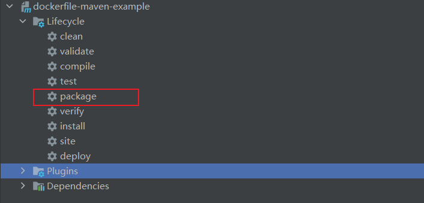
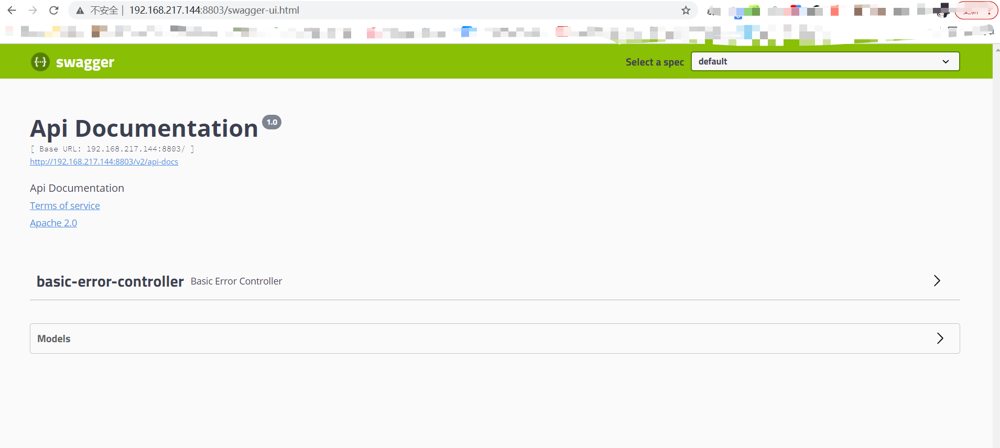

# 基于Dockerfile+Maven插件为SpringBoot应用构建镜像（推荐）

## 简介

本示例使用Dockerfile + docker-maven-plugin插件的方式 ，为SpringBoot应用构建镜像（推荐）。

> 推荐的理由：  打包时自动构建镜像且可以通过 `Dockerfile` 灵活配置，可以在构建时执行一些其他的脚本

## docker开启远程API

参考：[基于Maven插件为SpringBoot应用构建镜像（一）](docker-maven-1.md)

## 编写Dockerfile文件

```dockerfile
# 该镜像需要依赖的基础镜像
FROM java:8
# 将当前目录下的jar包复制到docker容器的/目录下
ADD dockerfile-maven-example-0.0.1-SNAPSHOT.jar /app.jar
# 运行过程中创建一个app.jar文件
RUN bash -c 'touch /app.jar'
# 声明服务运行在8803端口
EXPOSE 8803
# 指定docker容器启动时运行jar包
ENTRYPOINT ["java", "-jar","/app.jar"]
# 指定维护者的名字
MAINTAINER tuonioooo
```

## 使用maven打包应用

`pom.xml` 文件中添加 `docker-maven-plugin` 依赖

```xml
<build>
    <plugins>
        <plugin>
            <groupId>org.springframework.boot</groupId>
            <artifactId>spring-boot-maven-plugin</artifactId>
            <configuration>
                <excludes>
                    <exclude>
                        <groupId>org.projectlombok</groupId>
                        <artifactId>lombok</artifactId>
                    </exclude>
                </excludes>
            </configuration>
        </plugin>
        <!--配置docker打包插件-->
        <plugin>
            <groupId>com.spotify</groupId>
            <artifactId>docker-maven-plugin</artifactId>
            <version>1.1.0</version>
            <!--如果想在项目打包时构建镜像添加 `mvn clean -DskipTests package` 会同时构建镜像 相当于 mvn clean -DskipTests package docker:build -->
            <executions>
                <execution>
                    <id>build-image</id>
                    <phase>package</phase>
                    <goals>
                        <goal>build</goal>
                    </goals>
                </execution>
            </executions>
            <configuration>
                <!-- 配置docker服务器地址 -->
                <dockerHost>http://192.168.217.144:2375</dockerHost>
                <imageName>my_df_maven/${project.name}:${project.version}</imageName> <!--镜像名称-->
                <!-- 配置Dockerfile目录 说明：配置dockerDirectory后会忽略掉pom里的baseImage, maintainer, cmd and entryPoint配置, 只保留resources配置 -->
                <dockerDirectory>${project.basedir}/docker</dockerDirectory>
                <forceTags>true</forceTags><!--覆盖已存在的标签 镜像-->
                <resources>
                    <resource>
                        <targetPath>/</targetPath><!-- 将打包后的资源文件复制到该目录，如果定义了dockerDirectory，将会复制到 dockerDirectory目录下 -->
                        <directory>${project.build.directory}</directory>
                        <include>${project.build.finalName}.jar</include>
                        <include>classes/1.txt</include>
                    </resource>
                </resources>
            </configuration>
        </plugin>
    </plugins>
</build>
```

使用idea maven插件打包



输出信息

```text
[INFO] Building image my_df_maven/dockerfile-maven-example:0.0.1-SNAPSHOT
Step 1/6 : FROM java:8

 ---> d23bdf5b1b1b
Step 2/6 : ADD dockerfile-maven-example-0.0.1-SNAPSHOT.jar /app.jar

 ---> a88647ddac35
Step 3/6 : RUN bash -c 'touch /app.jar'

 ---> Running in e0bddec529fb
Removing intermediate container e0bddec529fb
 ---> c8c194b4f590
Step 4/6 : EXPOSE 8803

 ---> Running in ac936d667921
Removing intermediate container ac936d667921
 ---> ebab14222c4b
Step 5/6 : ENTRYPOINT ["java", "-jar","/app.jar"]

 ---> Running in 0f33bb18b5c8
Removing intermediate container 0f33bb18b5c8
 ---> c3bc601f3589
Step 6/6 : MAINTAINER tuonioooo

 ---> Running in 8f8705ac91ca
Removing intermediate container 8f8705ac91ca
 ---> 75b139958077
ProgressMessage{id=null, status=null, stream=null, error=null, progress=null, progressDetail=null}
Successfully built 75b139958077
Successfully tagged my_df_maven/dockerfile-maven-example:0.0.1-SNAPSHOT
[INFO] Built my_df_maven/dockerfile-maven-example:0.0.1-SNAPSHOT
[INFO] ------------------------------------------------------------------------
[INFO] BUILD SUCCESS
[INFO] ------------------------------------------------------------------------
[INFO] Total time:  29.940 s
[INFO] Finished at: 2022-11-02T12:14:55+08:00
[INFO] ------------------------------------------------------------------------

Process finished with exit code 0

```

docker服务器地址（我的是192.168.217.144）, 查看结果

```text
 docker images
REPOSITORY                             TAG              IMAGE ID       CREATED         SIZE
my_df_maven/dockerfile-maven-example   0.0.1-SNAPSHOT   75b139958077   8 minutes ago   699MB
my_dfile/dockerfile-example            0.0.1-SNAPSHOT   ce44f6e0bb51   3 hours ago     699MB
my_spotify/docker-plugin-example       0.0.1-SNAPSHOT   1d0c230e41ed   14 hours ago    671MB
my/docker-plugin-example               0.0.1-SNAPSHOT   22962486feee   18 hours ago    671MB
nginx                                  latest           605c77e624dd   10 months ago   141MB
redis                                  latest           7614ae9453d1   10 months ago   113MB
mysql                                  5.7              c20987f18b13   10 months ago   448MB
jenkins/jenkins                        lts              2a4bbe50c40b   11 months ago   441MB
java                                   8                d23bdf5b1b1b   5 years ago     643MB
```

## 启动

删除旧容器和镜像

```docker
docker stop dockerfile-maven-01
echo '----stop container----'
docker rm dockerfile-maven-01
echo '----rm container----'
docker rmi `docker images | grep none | awk '{print $3}'`
echo '----rm none images----'
```

启动docker

```docker

mkdir -p /mount/apps/dockerfile-maven-example/logs

docker run -p 8803:8803 --name dockerfile-maven-01 \
  -v /etc/localtime:/etc/localtime \
  -v /mount/apps/dockerfile-maven-example/logs:/logs \
  -d my_df_maven/dockerfile-maven-example:0.0.1-SNAPSHOT
```

进行访问测试，地址：http://192.168.217.144:8803/swagger-ui.html



## 演示项目地址

[https://gitee.com/ecs-common-deploy/dockerfile-maven-example.git](https://gitee.com/ecs-common-deploy/dockerfile-maven-example.git)
