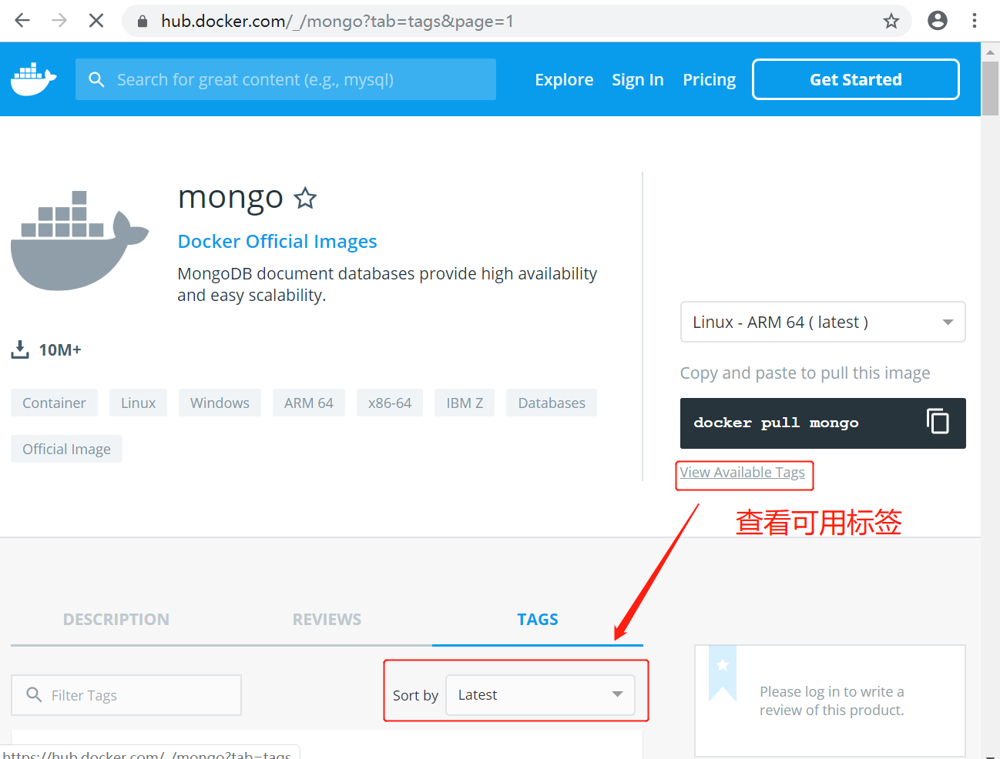
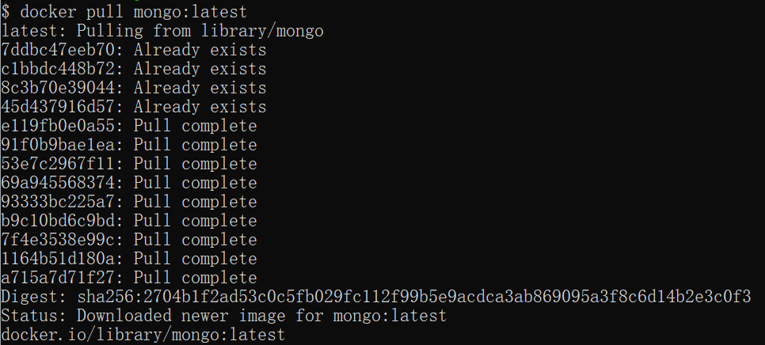

# docker安装MongoDB

MongoDB 是一个免费的开源跨平台面向文档的 NoSQL 数据库程序。

### 1、查看可用的 MongoDB 版本

访问 MongoDB 镜像库地址： <https://hub.docker.com/_/mongo?tab=tags&page=1>。

可以通过 Sort by 查看其他版本的 MongoDB，默认是最新版本 **mongo:latest**。



你也可以在下拉列表中找到其他你想要的版本：


此外，我们还可以用 docker search mongo 命令来查看可用版本：

```
$ docker search mongo
NAME                              DESCRIPTION                      STARS     OFFICIAL   AUTOMATED
mongo                             MongoDB document databases ...   1989      [OK]       
mongo-express                     Web-based MongoDB admin int...   22        [OK]       
mvertes/alpine-mongo              light MongoDB container          19                   [OK]
mongooseim/mongooseim-docker      MongooseIM server the lates...   9                    [OK]
torusware/speedus-mongo           Always updated official Mon...   9                    [OK]
jacksoncage/mongo                 Instant MongoDB sharded cluster  6                    [OK]
mongoclient/mongoclient           Official docker image for M...   4                    [OK]
jadsonlourenco/mongo-rocks        Percona Mongodb with Rocksd...   4                    [OK]
asteris/apache-php-mongo          Apache2.4 + PHP + Mongo + m...   2                    [OK]
19hz/mongo-container              Mongodb replicaset for coreos    1                    [OK]
nitra/mongo                       Mongo3 centos7                   1                    [OK]
ackee/mongo                       MongoDB with fixed Bluemix p...  1                    [OK]
kobotoolbox/mongo                 https://github.com/kobotoolb...  1                    [OK]
valtlfelipe/mongo                 Docker Image based on the la...  1                    [OK]
```

### 2、取最新版的 MongoDB 镜像

这里我们拉取官方的最新版本的镜像：

```
$ docker pull mongo:latest
```



### 3、查看本地镜像

使用以下命令来查看是否已安装了 mongo：

```
$ docker images
```


在上图中可以看到我们已经安装了最新版本（latest）的 mongo 镜像。

### 4、运行容器

安装完成后，我们可以使用以下命令来运行 mongo 容器：

```
$ docker run -itd --name mongo -p 27017:27017 mongo --auth
```

参数说明：

- **-p 27017:27017** ：映射容器服务的 27017 端口到宿主机的 27017 端口。外部可以直接通过 宿主机 ip:27017 访问到 mongo 的服务。
- **mongo**:  镜像名称
- **--auth**：需要密码才能访问容器服务。


### 5、安装成功

最后我们可以通过 **docker ps** 命令查看容器的运行信息：


接着使用以下命令添加用户和设置密码，并且尝试连接。

```
$ docker exec -it mongo mongo admin
# 创建一个名为 admin，密码为 123456 的用户。
>  db.createUser({ user:'admin',pwd:'123456',roles:[ { role:'userAdminAnyDatabase', db: 'admin'},"readWriteAnyDatabase"]});
# 尝试使用上面创建的用户信息进行连接。
> db.auth('admin', '123456')
```


参考：https://www.runoob.com/docker/docker-install-mongodb.html