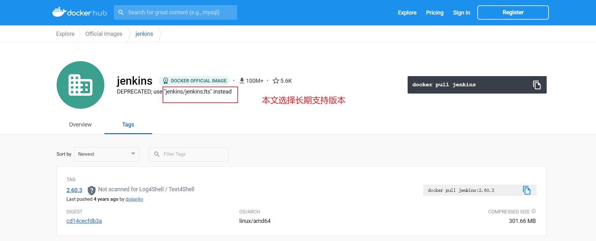

# docker安装jenkins

### 1、查看可用的 jenkins 版本

访问 jenkins 镜像库地址：  https://hub.docker.com/_/jenkins?tab=tags 。

可以通过 Sort by 查看其他版本的 jenkins，默认是最新版本 **jenkins:latest**。



此外，我们还可以用 docker search jenkins 命令来查看可用版本：

```
NAME                           DESCRIPTION                                     STARS     OFFICIAL   AUTOMATED
jenkins                        DEPRECATED; use "jenkins/jenkins:lts" instead   5560      [OK]
jenkins/jenkins                The leading open source automation server       3261
jenkins/jnlp-slave             a Jenkins agent which can connect to Jenkins…   151                  [OK]
jenkins/inbound-agent                                                          78
bitnami/jenkins                Bitnami Docker Image for Jenkins                54                   [OK]
jenkins/slave                  base image for a Jenkins Agent, which includ…   48                   [OK]
jenkins/agent                                                                  46
jenkins/ssh-slave              A Jenkins slave using SSH to establish conne…   38                   [OK]
jenkins/ssh-agent              Docker image for Jenkins agents connected ov…   27
jenkins/jnlp-agent-docker                                                      8
jenkins/jnlp-agent-maven       A JNLP-based agent with Maven 3 built in        7
jenkins/pct                    Plugin Compat Tester                            5                    [OK]
jenkins/evergreen              An automatically self-updating Jenkins distr…   5
jenkins/jnlp-agent-python      A JNLP-based agent with Python built in         3
jenkins/jenkins-experimental   Experimental images of Jenkins. These images…   3                    [OK]
jenkins/jnlp-agent-alpine                                                      2
jenkins/jnlp-agent-coresdk                                                     2
rancher/jenkins-jenkins                                                        1
jenkins/jnlp-agent-node                                                        1
jenkins/jenkinsfile-runner     Jenkinsfile Runner packages                     1
jenkins/core-pr-tester         Docker image for testing pull-requests sent …   1
jenkins/ath                    Jenkins Acceptance Test Harness                 1                    [OK]
jenkins/jnlp-agent-ruby                                                        1
rancher/jenkins-slave          Jenkins Build Slave                             0                    [OK]
rancher/jenkins-jnlp-slave                                                     0

```

### 2、取长期支持版本的 jenkins 镜像

这里选择长期支持版本，下载完成后，查看镜像

```
$ docker pull jenkins/jenkins:lts
```

### 3、查看本地镜像

```
$ docker images
REPOSITORY        TAG       IMAGE ID       CREATED         SIZE
jenkins/jenkins   lts       2a4bbe50c40b   11 months ago   441MB
```

### 4、设置宿主机目录权限，方便于容器映射

```
$ mkdir /mydata/jenkins
$ chown -R 1000:1000 /mydata/jenkins
$ chown -R 1000:1000 /usr/local/src/jdk/jdk1.8/ （如果需要挂载jdk，可以设置权限）
$ chown -R 1000:1000 /opt/apache-maven-3.5.0/	（如果需要maven，可以设置权限）
```

> 说明：需要修改映射的目录权限，因为当映射本地数据卷时，/mydata/jenkins/目录的拥有者为root用户，
>
> 而容器中jenkins用户的 uid 为 1000。

### 5、运行容器

```
$ docker run -p 8080:8080  \
  -v /mydata/jenkins/:/var/jenkins_home \
  -v /usr/local/apache-maven-3.8.6:/usr/local/apache-maven-3.8.6 \
  -v /var/run/docker.sock:/var/run/docker.sock \
  -v /usr/bin/docker:/usr/bin/docker \
  -e JAVA_OPTS=-Duser.timezone=Asia/Shanghai \
  --restart "always" \
  -d jenkins/jenkins:lts
```

如果没有授权宿主主机目录的权限，可以使用授予root权限执行容器命令

```
docker run -p 8080:8080  \
  -v /mydata/jenkins/:/var/jenkins_home \
  -v /usr/local/apache-maven-3.8.6:/usr/local/apache-maven-3.8.6 \
  -v /var/run/docker.sock:/var/run/docker.sock \
  -v /usr/bin/docker:/usr/bin/docker \
  -v /usr/local/apache-maven-3.8.6/: /usr/local/apache-maven-3.8.6/
  -v /usr/lib/x86_64-linux-gnu/libltdl.so.7:/usr/lib/x86_64-linux-gnu/libltdl.so.7
  -e JAVA_OPTS=-Duser.timezone=Asia/Shanghai \
  --restart "always" \
  --user root \
  --privileged=true \
  -d jenkins/jenkins:lts
```

> 命令说明：
>
> -v /mydata/jenkins/:/var/jenkins_home   ：挂载宿主主机目录到容器目录
>
> -v /var/run/docker.sock:/var/run/docker.sock ：挂载docker的实例
>
> -v /usr/local/apache-maven-3.8.6/: /usr/local/apache-maven-3.8.6/：挂载宿主主机的maven
>
> -e JAVA_OPTS=-Duser.timezone=Asia/Shanghai ：设置环境变量
>
> --restart "always" ：随着容器启动而启动
>
> --user root     ：root用户执行命令
>
> --privileged=true ：授予root权限
>
> -d jenkins/jenkins:lts：后台运行镜像

### 6、jenkins配置参考

[Jenkins配置&插件安装&项目构建实战演示](https://github.com/tuonioooo/engineering-management/blob/master/jenkins-ji-cheng/Jenkins%E9%85%8D%E7%BD%AE&%E6%8F%92%E4%BB%B6%E5%AE%89%E8%A3%85&%E9%A1%B9%E7%9B%AE%E6%9E%84%E5%BB%BA%E5%AE%9E%E6%88%98%E6%BC%94%E7%A4%BA.md)


