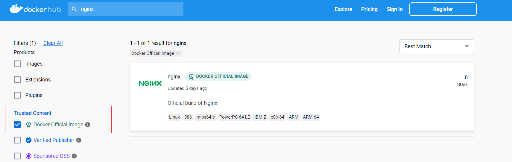
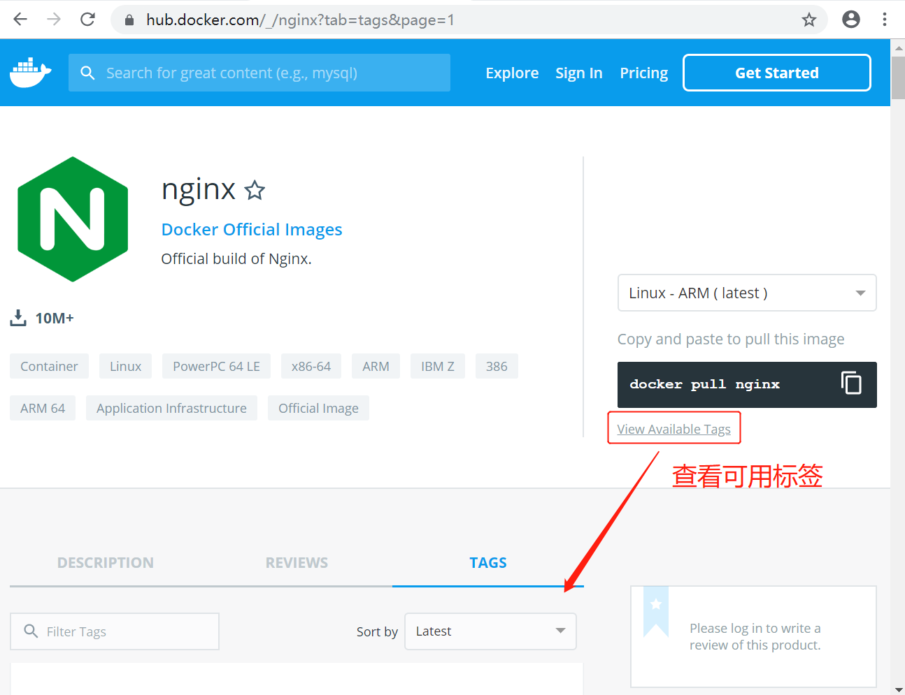
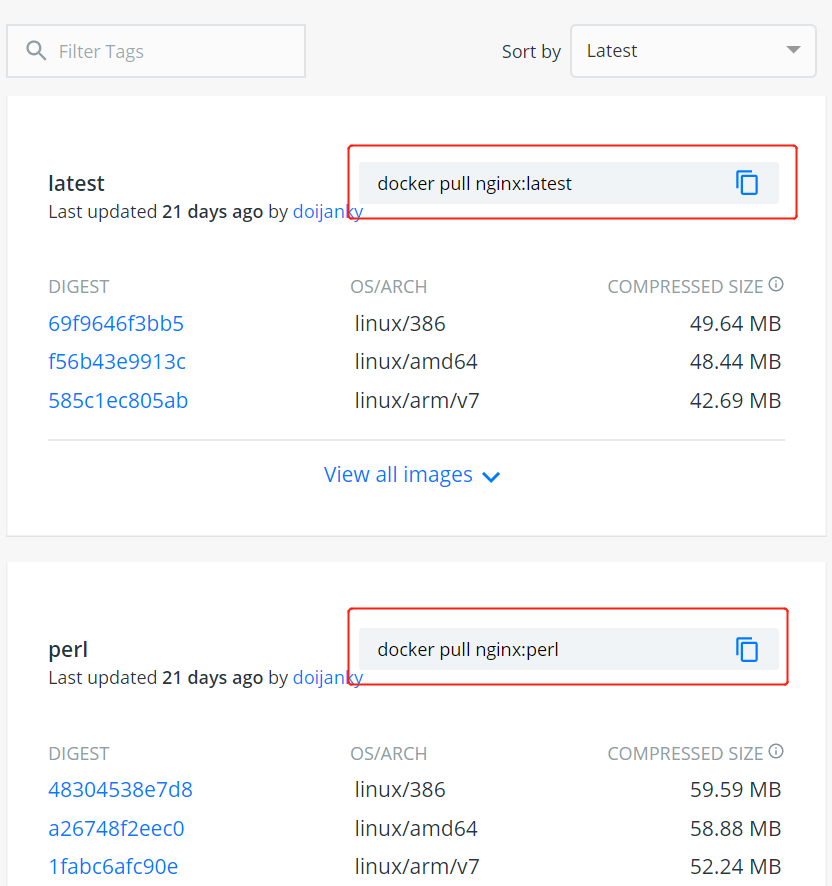
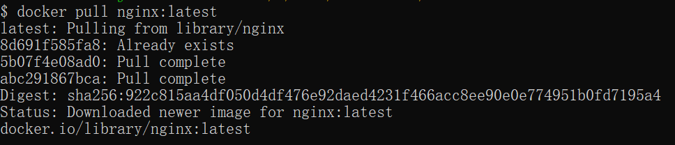
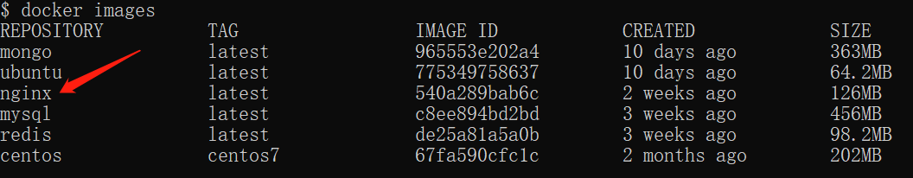
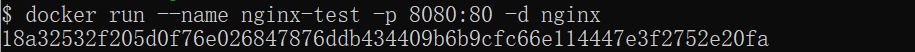
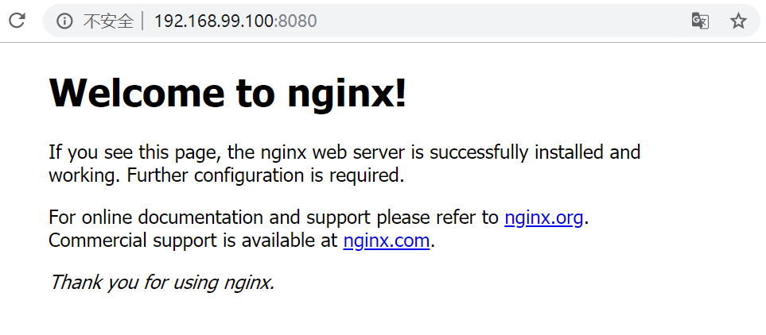

# docker 安装nginx

Nginx 是一个高性能的 HTTP 和反向代理 web 服务器，同时也提供了 IMAP/POP3/SMTP 服务 。

### 1、查看可用的 Nginx 版本

访问 Nginx 镜像库地址： <https://hub.docker.com/_/nginx?tab=tags>。

也可以通过search查看Nginx镜像库地址，需要勾选 Docker Official Image 如下




可以通过 Sort by 查看其他版本的 Nginx，默认是最新版本 **nginx:latest**。




你也可以在下拉列表中找到其他你想要的版本：

[](assets/install/nginx2.png)

此外，我们还可以用 docker search nginx 命令来查看可用版本：

```
$ docker search nginx
NAME                      DESCRIPTION                                     STARS     OFFICIAL   AUTOMATED
nginx                     Official build of Nginx.                        3260      [OK]       
jwilder/nginx-proxy       Automated Nginx reverse proxy for docker c...   674                  [OK]
richarvey/nginx-php-fpm   Container running Nginx + PHP-FPM capable ...   207                  [OK]
million12/nginx-php       Nginx + PHP-FPM 5.5, 5.6, 7.0 (NG), CentOS...   67                   [OK]
maxexcloo/nginx-php       Docker framework container with Nginx and ...   57                   [OK]
...
```

### 2、取最新版的 Nginx 镜像

这里我们拉取官方的最新版本的镜像：

```
$ docker pull nginx:latest
```



### 3、查看本地镜像

使用以下命令来查看是否已安装了 nginx：

```
$ docker images
```



在上图中可以看到我们已经安装了最新版本（latest）的 nginx 镜像。

### 4、运行容器

安装完成后，我们可以使用以下命令来运行 nginx 容器：

```
$ docker run --name nginx-test -p 8080:80 -d nginx
```

参数说明：

- **--name nginx-test**：容器名称。
- **-p 8080:80**： 端口进行映射，将本地 8080 端口映射到容器内部的 80 端口（主机端口**:**容器端口）。
- **-d nginx**： 设置容器在在后台一直运行。



### 5、安装成功

最后我们可以通过浏览器可以直接访问 8080 端口的 nginx 服务：



### 6、进阶操作，映射本地文件便于动态扩展

创建一个mydata文件夹

```
[root@localhost ~]# mkdir -p /mydata/nginx/conf
[root@localhost ~]# mkdir -p /mydata/nginx/logs
[root@localhost ~]# mkdir -p /mydata/nginx/html
[root@localhost ~]# mkdir -p /mydata/nginx/conf.d
```

> 说明  
> mkdir -p /mydata/nginx/conf			#存放配置文件入口文件  
> mkdir -p /mydata/nginx/logs			#存放日志文件  
> mkdir -p /mydata/nginx/html			#存放静态文件 可以动态注入自己的静态页面  
> mkdir -p /mydata/nginx/conf.d	    #存放多个配置文件（相当于vhost）  

先运行一次容器（为了拷贝配置文件）：

```
$ docker run --name nginx-test -p 8080:80 -d nginx
```

将容器内的配置文件复制到主机目录上

```
[root@localhost ~]# docker container cp nginx-test:/etc/nginx/nginx.conf /mydata/nginx/conf
[root@localhost ~]# docker container cp nginx-test:/etc/nginx/conf.d/default.conf /mydata/nginx/conf.d
[root@localhost ~]# docker container cp nginx-test:/usr/share/nginx/html /mydata/nginx

```

> #说明
>
> #映射配置文件入口文件
> docker container cp nginx-test:/etc/nginx/nginx.conf /mydata/nginx/conf
> #映射配置文件
> docker container cp nginx-test:/etc/nginx/conf.d/default.conf /mydata/nginx/conf.d
> #映射静态文件
> docker container cp nginx-test:/usr/share/nginx/html /mydata/nginx

终止并删除容器：

```bash
docker stop nginx-test
docker rm nginx-test
```

创建新的Nginx容器，并映射本地文件

```
docker run -p 8080:80 --name nginx-test \
-v /mydata/nginx/html:/usr/share/nginx/html \
-v /mydata/nginx/conf.d/default.conf:/etc/nginx/conf.d/default.conf  \
-v /mydata/nginx/conf/nginx.conf:/etc/nginx/nginx.conf \
-v /mydata/nginx/logs:/var/log/nginx  \
--privileged=true \
-d nginx
```

> #说明
> docker run -p 8080:80 --name nginx-test \
>
> -p 8080:80 主机端口: 容器端口
>
> --name 容器名称
>
> -v /mydata/nginx/html:/usr/share/nginx/html \ (映射静态文件)
>
> -v /mydata/nginx/conf.d/default.conf:/etc/nginx/conf.d/default.conf  \ (映射配置文件)
>
> -v /mydata/nginx/conf/nginx.conf:/etc/nginx/nginx.conf \(映射配置文件入口文件)
>
> -v /mydata/nginx/logs:/var/log/nginx  \ (映射日志文件)
>
> -d nginx  （后台运行nginx镜像）
>
> --privileged=true （容器以root权限运行）


参考原文 ： https://www.runoob.com/docker/docker-install-nginx.html
