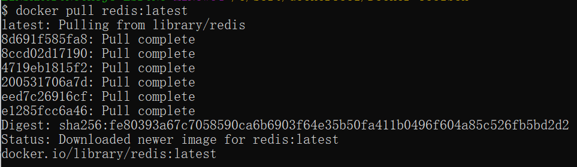

# docker安装redis

Redis 是一个开源的使用 ANSI C 语言编写、支持网络、可基于内存亦可持久化的日志型、Key-Value 的 NoSQL 数据库，并提供多种语言的 API。

### 1、查看可用的 Redis 版本

访问 Redis 镜像库地址： <https://hub.docker.com/_/redis?tab=tags>。

可以通过 Sort by 查看其他版本的 Redis，默认是最新版本 **redis:latest**。


你也可以在下拉列表中找到其他你想要的版本：


也可以通过search查看redis镜像库地址，需要勾选 Docker Official Image 如图：


此外，我们还可以用 docker search redis 命令来查看可用版本：

```
$ docker search  redis
NAME                      DESCRIPTION                   STARS  OFFICIAL  AUTOMATED
redis                     Redis is an open source ...   2321   [OK]       
sameersbn/redis                                         32                   [OK]
torusware/speedus-redis   Always updated official ...   29             [OK]
bitnami/redis             Bitnami Redis Docker Image    22                   [OK]
anapsix/redis             11MB Redis server image ...   6                    [OK]
webhippie/redis           Docker images for redis       4                    [OK]
clue/redis-benchmark      A minimal docker image t...   3                    [OK]
williamyeh/redis          Redis image for Docker        3                    [OK]
unblibraries/redis        Leverages phusion/baseim...   2                    [OK]
greytip/redis             redis 3.0.3                   1                    [OK]
servivum/redis            Redis Docker Image            1                    [OK]
...
```

### 2、取最新版的 Redis 镜像

这里我们拉取官方的最新版本的镜像：

```
$ docker pull redis:latest
```



### 3、查看本地镜像

使用以下命令来查看是否已安装了 redis：

```
$ docker images
```


在上图中可以看到我们已经安装了最新版本（latest）的 redis 镜像。

### 4、运行容器

安装完成后，我们可以使用以下命令来运行 redis 容器：

```
$ docker run -itd --name redis-test -p 6379:6379 redis
```

参数说明：

- **-p 6379:6379**：宿主机的 6379 端口:容器服务的 6379 端口。外部可以直接通过宿主机ip:6379 访问到 Redis 的服务。


### 5、安装成功

最后我们可以通过 **docker ps** 命令查看容器的运行信息：


接着我们通过 redis-cli 连接测试使用 redis 服务。

```
$ docker exec -it redis-test /bin/bash(bash)
```


### 6、高级进阶，data 映射本地文件

#### 使用如下命令启动Redis服务

```bash
docker run -p 6379:6379 --name redis \
-v /mydata/redis/data:/data \
--restart=always \
-d redis redis-server --appendonly yes
```

> #参数说明
>
> -p 6379:6379  主机端口:容器端口号，将容器端口号映射到主机端口号
>
> --name redis #设置容器的名称
>
> -v /mydata/redis/data:/data  #将容器data文件夹映射到主机/mydata/redis/data
>
> -d redis:7  #镜像名称
>
> redis-server --appendonly yes  # 在容器执行redis-server启动命令，并打开redis持久化配置
>
> --restart=always  # 随[docker](https://so.csdn.net/so/search?q=docker&spm=1001.2101.3001.7020)启动而启动

进入Redis容器使用`redis-cli`命令进行连接：

```bash
docker exec -it redis redis-cli
```


#### 设置requirepass密码启动redis

如果容器存在先停止，删除

```
[root@localhost ~]# docker ps
CONTAINER ID   IMAGE     COMMAND                  CREATED         STATUS         PORTS                                       NAMES
95b48053b264   redis     "docker-entrypoint.s…"   4 minutes ago   Up 4 minutes   0.0.0.0:6379->6379/tcp, :::6379->6379/tcp   redis
8b53d2a04272   nginx     "/docker-entrypoint.…"   10 hours ago    Up 10 hours    0.0.0.0:8080->80/tcp, :::8080->80/tcp       nginx-test

[root@localhost ~]# docker stop redis
[root@localhost ~]# docker rm redis
```

启动redis容器

```
docker run -p 6379:6379 --name redis \
-v /mydata/redis/data:/data \
--restart=always \
-d redis redis-server --appendonly yes --requirepass '123456'
```

> 参数说明：
>
> 其他类似参数参考上方示例
>
> --requirepass '123456'   #设置认证密码


用密码登录容器

```
docker exec -it redis redis-cli -a 123456
或者
docker exec -it redis redis-cli -h 127.0.0.1 -p 6379 -a 123456
```

> 参数说明：
>
> -h 127.0.0.1 #默认不加为-h 127.0.0.1 
>
> -p 6379 #默认不加为 -p 6379 
>
> redis #容器名称，可以用使用容器Id
>
> -a 123456 #redis 认证密码 通常来讲不在这里输入 而是进入到客户端后输入，这样输入不安全，使用如上命令会有提示：
>
> `Warning: Using a password with '-a' or '-u' option on the command line interface may not be safe.`

登录时不带密码、进入redis-cli 使用 auth 认证密码

```
[root@localhost ~]# docker exec -it redis redis-cli
127.0.0.1:6379> set name allen
(error) NOAUTH Authentication required.
127.0.0.1:6379> auth 123456
OK
127.0.0.1:6379> set name allen
OK
127.0.0.1:6379> get name
"allen"
```


参考：https://www.runoob.com/docker/docker-install-redis.html