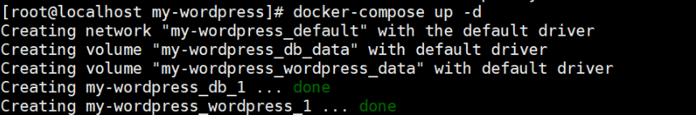

# docker-compose安装wordpress

创建my_wordpress目录

```text
mkdir my_wordpress
```

docker-compose.yml配置

```text
version: "3.9"
services:
  db:
    image: mysql:5.7
    volumes:
      - db_data:/var/lib/mysql
    restart: always
    environment:
      MYSQL_ROOT_PASSWORD: somewordpress
      MYSQL_DATABASE: wordpress
      MYSQL_USER: wordpress
      MYSQL_PASSWORD: wordpress
  wordpress:
    depends_on:
      - db
    image: wordpress:latest
    volumes:
      - wordpress_data:/var/www/html
    ports:
      - "8000:80"
    restart: always
    environment:
      WORDPRESS_DB_HOST: db:3306
      WORDPRESS_DB_USER: wordpress
      WORDPRESS_DB_PASSWORD: wordpress
      WORDPRESS_DB_NAME: wordpress
volumes:
  db_data: {}
  wordpress_data: {}
```

up命令启动

```text
docker-compose up -d
```



参考文档：

[https://hub.docker.com/_/wordpress](https://hub.docker.com/_/wordpress)

[https://www.cnblogs.com/nickchou/p/14430691.html](https://www.cnblogs.com/nickchou/p/14430691.html)
