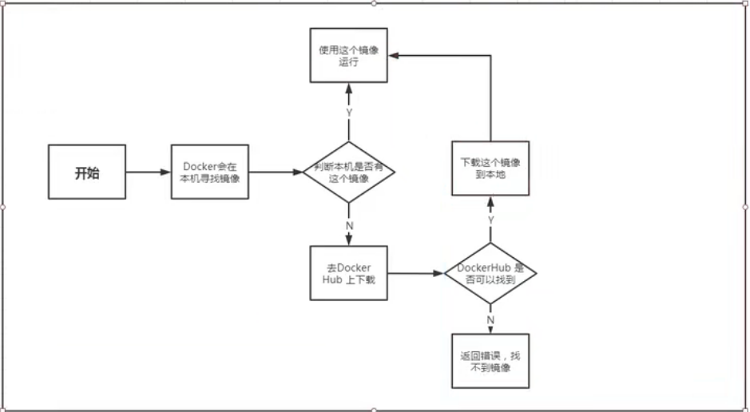
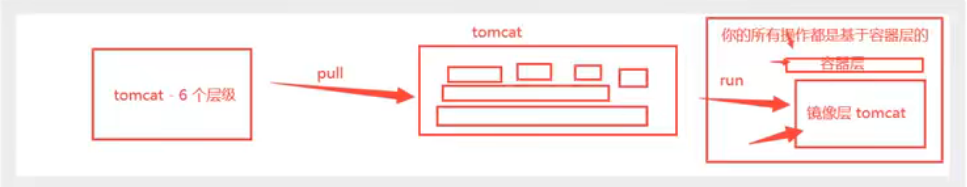

# docker 运行原理

## run 运行的流程

## 底层原理

##  docker镜像加载原理

UnionFS（联合文件系统） ：是一种分层，轻量级并且高性能的文件系统，它支持对文件系统的修改作为一次提交来一层层叠加，同时可以将不同目录挂载到同一个虚拟文件系统下

特性：一次同时加载多个文件系统，但从外面看来，只能看到一个文件系统，联合加载会把各层文件系统叠加起来，这样最终的文件系统会包含所有底层的文件和目录

bootfs（boot file system）主要包含BootLoader和kernel ：docker的最底层是bootfs，boot加载完成之后整个内核都在内存中了，此时内存的使用权已由bootfs转交给内核，此时系统会卸载bootfs

rootfs（root file system）:在bootfs之上，包含的就是典型的linux系统中的 /dev,/proc,/bin,/etc 等标准目录和文件，rootfs就是各种不同的操作系统发行版，比如Ubuntu，Centos等

镜像是分层的

可观察pull一个容器是的下载过程

[root@localhost ~]# docker image inspect redis:latest
//....

"RootFS": {
"Type": "layers",
"Layers": [
"sha256:e1bbcf243d0e7387fbfe5116a485426f90d3ddeb0b1738dca4e3502b6743b325",
"sha256:58e6a16139eebebf7f6f0cb15f9cb3c2a4553a062d2cbfd1a782925452ead433",
"sha256:503a5c57d9786921c992b7b2216ae58f69dcf433eedb28719ddea3606b42ce26",
"sha256:277199a0027e044f64ef3719a6d7c3842e99319d6e0261c3a5190249e55646cf",
"sha256:d0d567a1257963b9655dfceaddc76203c8544fbf6c8672b372561a3c8a3143d4",
"sha256:a7115aa098139866d7073846e4321bafb8d5ca0d0f907a3c9625f877311bee7c"
]
}

特点：
docker镜像都是只读的，当容器启动时，一个新的可写层被加载到镜像的顶部（这一层就是所说的容器层，容器之下的都交镜像层）

