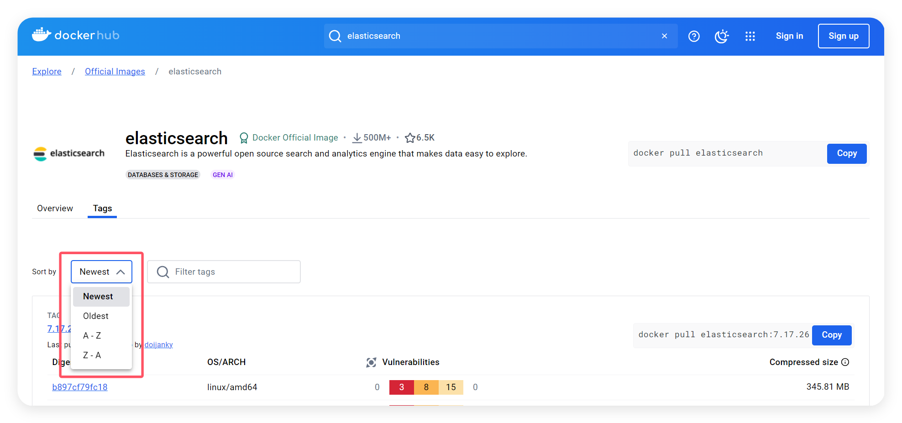

# Docker 安装 Elasticsearch

Elasticsearch是一个强大的开源搜索和分析引擎，使数据易于探索。

### 1、查看可用的 Elasticsearch 版本
访问 Elasticsearch 镜像库地址： [https://hub.docker.com/_/elasticsearch/tags](https://hub.docker.com/_/elasticsearch/tags)。

可以通过 Sort by 查看其他版本的 Elasticsearch，你也可以在下拉列表中找到其他你想要的版本



此外，我们还可以用 **docker search elasticsearch** 命令来查看可用版本：

```shell
docker search elasticsearch
```

### 2、拉取 `7.12.1`版本 Elasticsearch 镜像

```shell
docker pull elasticsearch:7.12.1
```
输出

```shell
7.12.1: Pulling from library/elasticsearch
7a0437f04f83: Pull complete
ed4a47ec20b2: Pull complete
74e4f4b7e738: Pull complete
ef2a2418a5f4: Pull complete
646dbf47f747: Pull complete
3ffbf21442fc: Pull complete
e04f00c0d464: Pull complete
Digest: sha256:622f854572780281bc85b5fde33be27e99670941ed8b7eea5ba4aaf533fa64ec
Status: Downloaded newer image for elasticsearch:7.12.1
docker.io/library/elasticsearch:7.12.1
```

### 3、查看本地镜像
使用以下命令来查看是否已安装了 Elasticsearch：

```shell
docker images
```

输出

```shell
REPOSITORY                 TAG       IMAGE ID       CREATED         SIZE
redis                      latest    e40e2763392d   12 months ago   138MB
redis/redis-stack          latest    1915167b30ba   13 months ago   790MB
redis/redis-stack-server   latest    ebee26a6f063   13 months ago   462MB
elasticsearch              7.12.1    41dc8ea0f139   3 years ago     851MB
```


### 4、运行容器
安装完成后，我们可以使用以下命令来运行 Elasticsearch 容器：

```shell
docker run --name elasticsearch-test -p 9200:9200 -p 9300:9300 -e "discovery.type=single-node" -d elasticsearch:7.12.1
```
参数说明：

+ **--name elasticsearch-test**：容器名称。
+ **-p 9200:9200**：将本地 9200 端口映射到容器内部的 9200 端口，用于 HTTP 请求。
+ **-p 9300:9300**：将本地 9300 端口映射到容器内部的 9300 端口，用于集群通信。
+ **-e "discovery.type=single-node"**： 设置单节点模式（适合本地开发环境）。
+ **-d elasticsearch**：设置容器在后台运行。

输出

```shell
fa025a8b22b9c81ca0ede872a7c34ff0cb2bd6a9859cd4331b9a7ed3f3697e16
```

### 5、安装成功

安装完成后，我们可以通过浏览器访问 http://localhost:9200 检查 Elasticsearch 是否运行正常：

浏览器返回类似如下信息表示安装成功：

```json
{
  "name" : "9b1b1e0e1d24",
  "cluster_name" : "docker-cluster",
  "cluster_uuid" : "s1mZvc97TZ--_iM9",
  "version" : {
    "number" : "8.x.x",
    "build_flavor" : "default",
    "build_type" : "docker",
    "build_hash" : "abc123",
    "build_date" : "2024-01-01T00:00:00.000Z",
    "lucene_version" : "9.x.x",
    "minimum_wire_compatibility_version" : "7.x.x",
    "minimum_index_compatibility_version" : "7.x.x"
  },
  "tagline" : "You Know, for Search"
}

```


