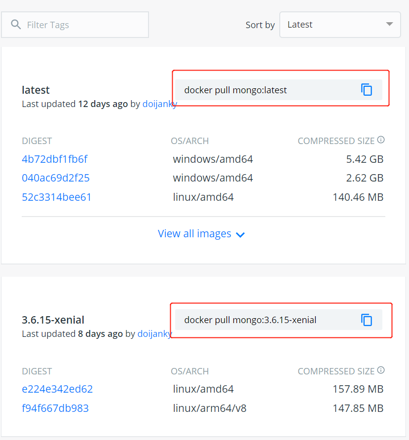

# Docker 安装 MongoDB

MongoDB 是一个免费的开源跨平台面向文档的 NoSQL 数据库程序。

### 1、查看可用的 MongoDB 版本
访问 MongoDB 镜像库地址： [https://hub.docker.com/_/mongo?tab=tags&page=1](https://hub.docker.com/_/mongo?tab=tags&page=1)。

可以通过 Sort by 查看其他版本的 MongoDB，默认是最新版本 **mongo:latest**。


你也可以在下拉列表中找到其他你想要的版本：



此外，我们还可以用 **docker search mongo** 命令来查看可用版本：

```shell
docker search mongo
NAME                              DESCRIPTION                      STARS     OFFICIAL   AUTOMATED
mongo                             MongoDB document databases ...   1989      [OK]       
mongo-express                     Web-based MongoDB admin int...   22        [OK]       
mvertes/alpine-mongo              light MongoDB container          19                   [OK]
mongooseim/mongooseim-docker      MongooseIM server the lates...   9                    [OK]
torusware/speedus-mongo           Always updated official Mon...   9                    [OK]
jacksoncage/mongo                 Instant MongoDB sharded cluster  6                    [OK]
mongoclient/mongoclient           Official docker image for M...   4                    [OK]
jadsonlourenco/mongo-rocks        Percona Mongodb with Rocksd...   4                    [OK]
asteris/apache-php-mongo          Apache2.4 + PHP + Mongo + m...   2                    [OK]
19hz/mongo-container              Mongodb replicaset for coreos    1                    [OK]
nitra/mongo                       Mongo3 centos7                   1                    [OK]
ackee/mongo                       MongoDB with fixed Bluemix p...  1                    [OK]
kobotoolbox/mongo                 https://github.com/kobotoolb...  1                    [OK]
valtlfelipe/mongo                 Docker Image based on the la...  1                    [OK]
```

### 2、取最新版的 MongoDB 镜像
这里我们拉取官方的最新版本的镜像：

```shell
docker pull mongo:latest
```


### 3、查看本地镜像
使用以下命令来查看是否已安装了 mongo：

```shell
docker images
```


在上图中可以看到我们已经安装了最新版本（latest）的 mongo 镜像。

### 4、运行容器
安装完成后，我们可以使用以下命令来运行 mongo 容器：

```shell
docker run -d -p 27017:27017 --name my-mongo-container mongo
```

**参数说明：**

+ `-d`: 后台运行容器。
+ `-p 27017:27017`: 将主机的27017端口映射到容器的27017端口。
+ `--name my-mongo-container`: 为容器指定一个名字，这里是`my-mongo-container`，你可以根据需要更改。


### 5、安装成功
最后我们可以通过 **docker ps** 命令查看容器的运行信息：

```shell
# docker ps
CONTAINER ID   IMAGE      ...   PORTS                    NAMES
d53e5d57668b   mongo      ...  :::27017->27017/tcp   my-mongo-container
```

你应该能够看到名为 **my-mongo-container** 的 MongoDB 容器正在运行。

接下来我们可以使用 MongoDB 客户端（例如 mongo shell）连接到运行中的 MongoDB 容器。

你可以使用以下命令连接到 MongoDB：

```shell
$ mongosh --host 127.0.0.1 --port 27017
Current Mongosh Log ID: 656d34911ff5455b0c3afdc0
Connecting to:          mongodb://127.0.0.1:27017/?directConnection=true&serverSelectionTimeoutMS=2000&appName=mongosh+2.1.0
Using MongoDB:          7.0.4
Using Mongosh:          2.1.0

For mongosh info see: https://docs.mongodb.com/mongodb-shell/
...
```

这将连接到本地主机的 27017 端口，你可以根据之前映射的端口进行调整。

进入 MongoDB 容器的 bash shell 命令如下：

```shell
docker exec -it my-mongo-container bash
```

记得在不再需要时停止和删除容器，可以使用以下命令：

```shell
docker stop my-mongo-container
docker rm my-mongo-container
```

### 6、进阶使用
[Docker MongoDB进阶配置](../advanced/docker-mogongdb-advanced.md)

