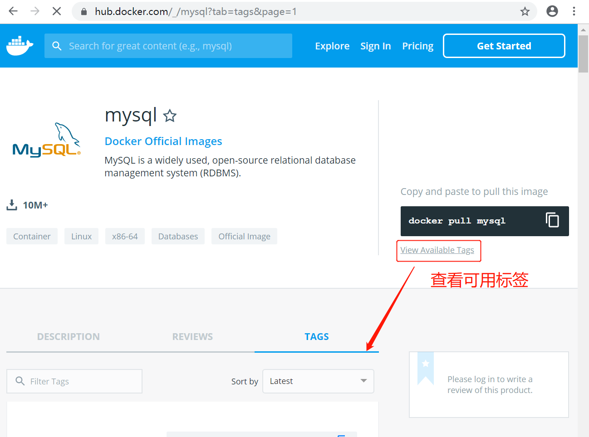
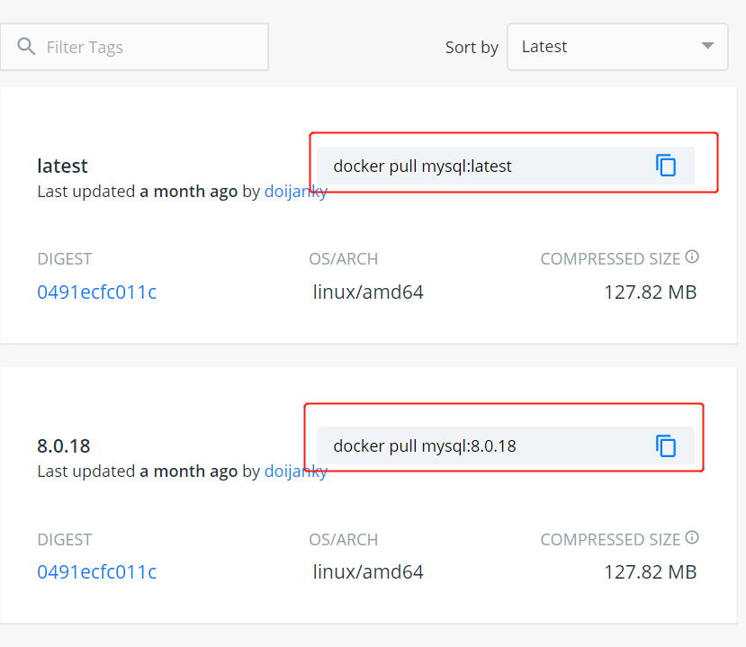
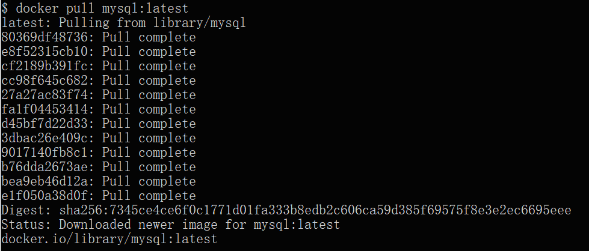
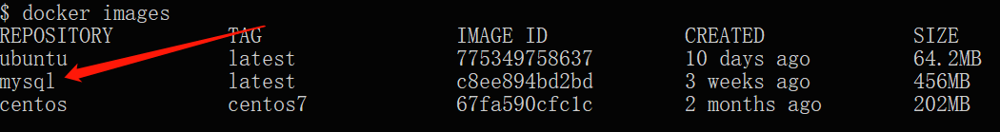
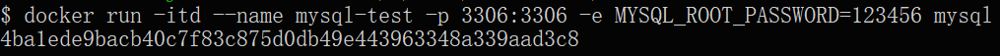
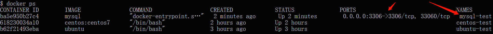
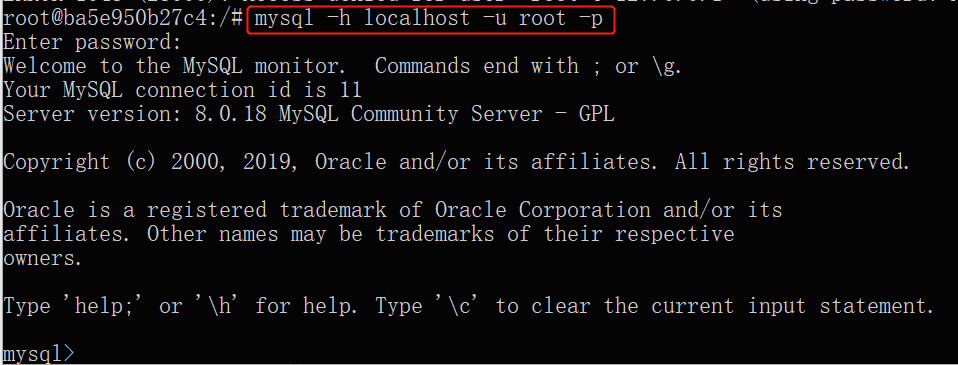

# Docker 安装 MySQL
MySQL 是世界上最受欢迎的开源数据库。凭借其可靠性、易用性和性能，MySQL 已成为 Web 应用程序的数据库优先选择。

### 1、查看可用的 MySQL 版本
访问 MySQL 镜像库地址：[https://hub.docker.com/_/mysql?tab=tags](https://hub.docker.com/_/mysql?tab=tags) 。

可以通过 Sort by 查看其他版本的 MySQL，默认是最新版本 **mysql:latest** 。



你也可以在下拉列表中找到其他你想要的版本：



此外，我们还可以用 **docker search mysql** 命令来查看可用版本：

```shell
$ docker search mysql
NAME                     DESCRIPTION                                     STARS     OFFICIAL   AUTOMATED
mysql                    MySQL is a widely used, open-source relati...   2529      [OK]       
mysql/mysql-server       Optimized MySQL Server Docker images. Crea...   161                  [OK]
centurylink/mysql        Image containing mysql. Optimized to be li...   45                   [OK]
sameersbn/mysql                                                          36                   [OK]
google/mysql             MySQL server for Google Compute Engine          16                   [OK]
appcontainers/mysql      Centos/Debian Based Customizable MySQL Con...   8                    [OK]
marvambass/mysql         MySQL Server based on Ubuntu 14.04              6                    [OK]
drupaldocker/mysql       MySQL for Drupal                                2                    [OK]
azukiapp/mysql           Docker image to run MySQL by Azuki - http:...   2                    [OK]
...
```

### 2、拉取 MySQL 镜像
这里我们拉取官方的最新版本的镜像：

```shell
$ docker pull mysql:latest
```



### 3、查看本地镜像
使用以下命令来查看是否已安装了 mysql：

```shell
$ docker images
```



在上图中可以看到我们已经安装了最新版本（latest）的 mysql 镜像。

### 4、运行容器
安装完成后，我们可以使用以下命令来运行 mysql 容器：

```shell
$ docker run -itd --name mysql-test -p 3306:3306 -e MYSQL_ROOT_PASSWORD=123456 mysql
```

:::color1
**参数说明：**

+ **-p 3306:3306** ：映射容器服务的 3306 端口到宿主机的 3306 端口，外部主机可以直接通过 **宿主机ip:3306** 访问到 MySQL 的服务。
+ **MYSQL_ROOT_PASSWORD=123456**：设置 MySQL 服务 root 用户的密码。

:::



### 5、安装成功
通过 **docker ps** 命令查看是否安装成功：



本机可以通过 root 和密码 123456 访问 MySQL 服务。



### 6、进阶使用
[Docker MySql进阶配置](../advanced/docker-mysql-advanced.md)

