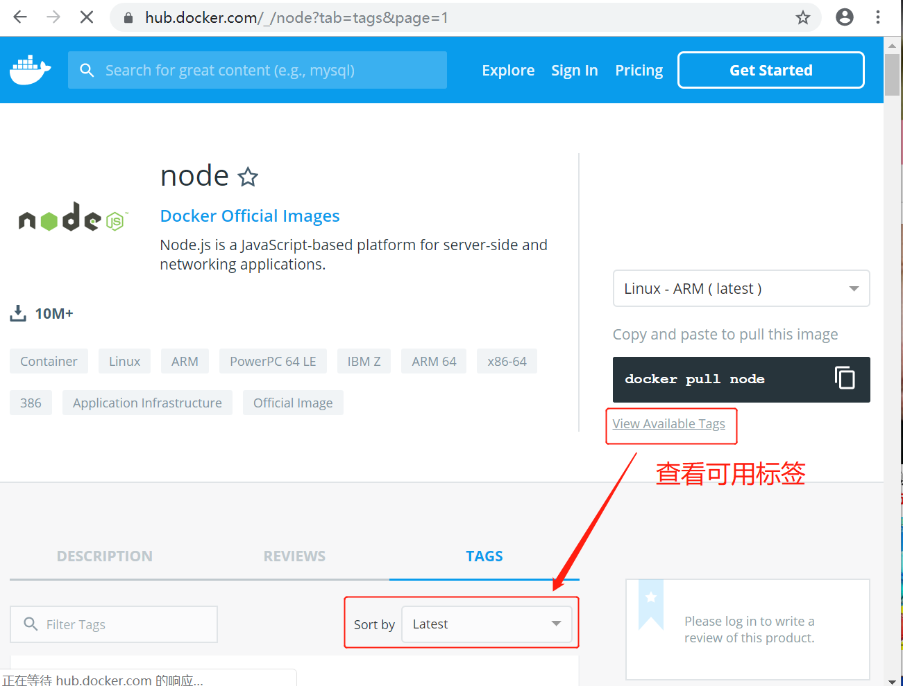
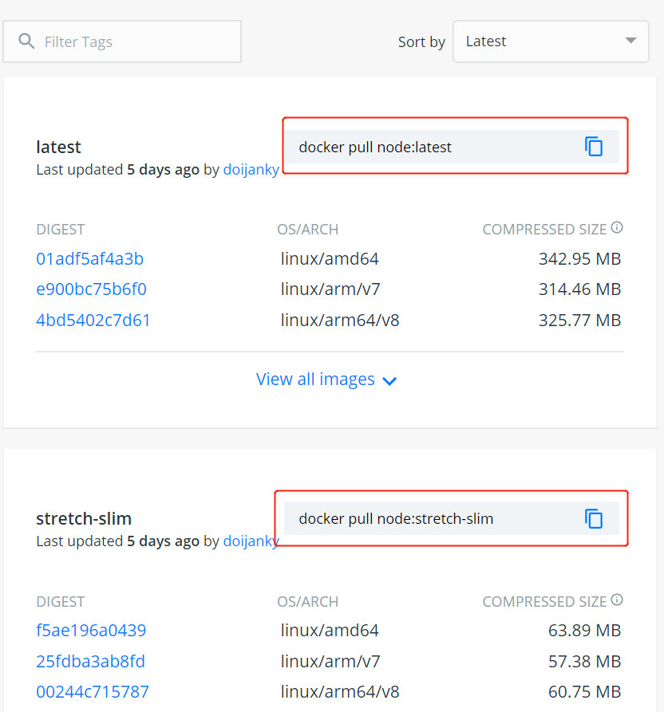
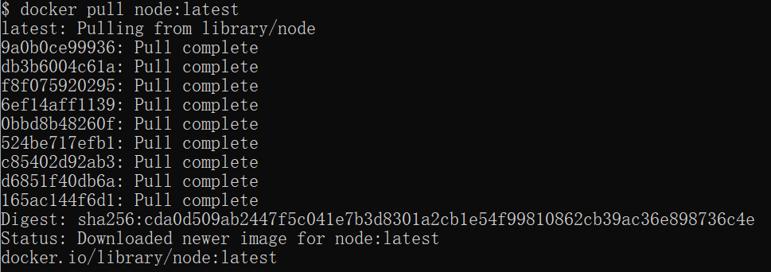
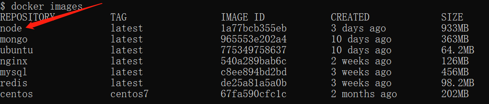
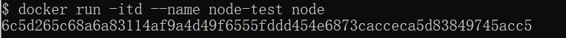
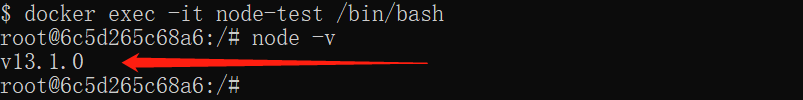

# Docker 安装 Node.js

Node.js 是一个基于 Chrome V8 引擎的 JavaScript 运行环境，是一个让 JavaScript 运行在服务端的开发平台。

### 1、查看可用的 Node 版本
访问 Node 镜像库地址： [https://hub.docker.com/_/node?tab=tags](https://hub.docker.com/_/node?tab=tags)。

可以通过 Sort by 查看其他版本的 Node，默认是最新版本 **node:latest**。



你也可以在下拉列表中找到其他你想要的版本：



此外，我们还可以用 **docker search node** 命令来查看可用版本：

```shell
$ docker search node
```

### 2、取最新版的 node 镜像
这里我们拉取官方的最新版本的镜像：

```shell
$ docker pull node:latest
```



### 3、查看本地镜像
使用以下命令来查看是否已安装了 node

```shell
$ docker images
```



在上图中可以看到我们已经安装了最新版本（latest）的 node 镜像。

### 4、运行容器
安装完成后，我们可以使用以下命令来运行 node 容器：

```shell
$ docker run -itd --name node-test node
```

参数说明：

+ **--name node-test**：容器名称。




### 5、安装成功
最后进入查看容器运行的 node 版本:

```shell
$ docker exec -it node-test /bin/bash
root@6c5d265c68a6:/# node -v
```



