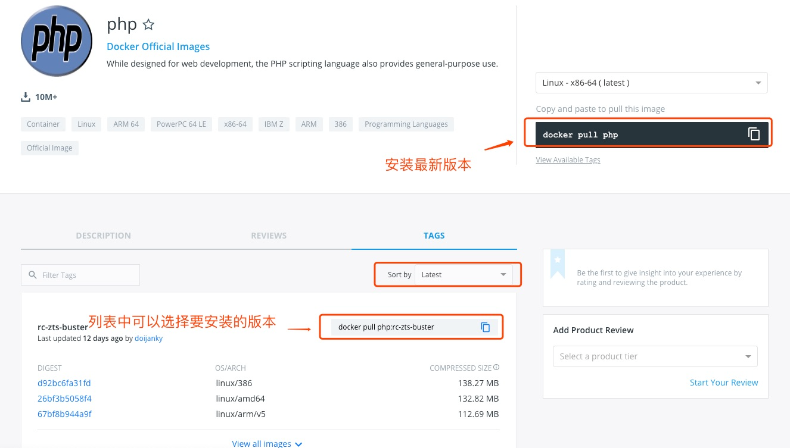
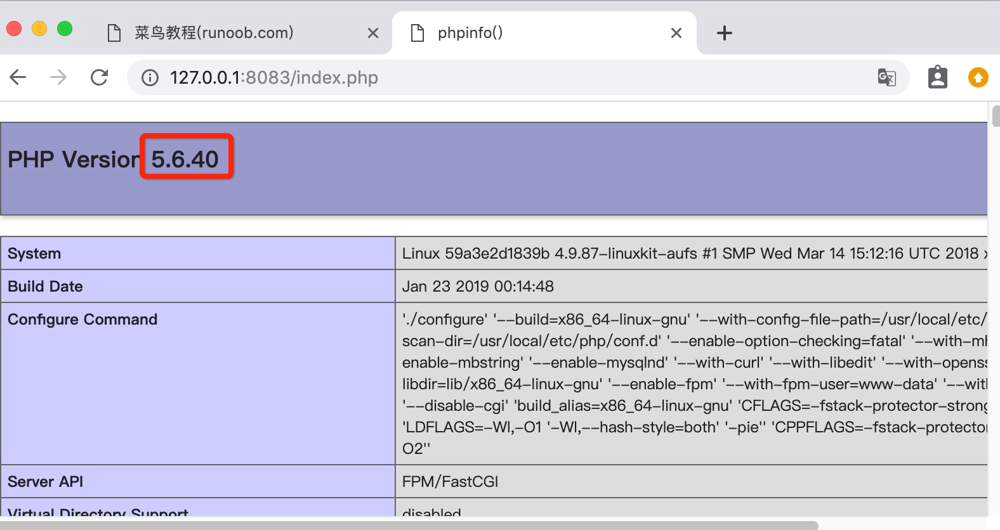

# Docker 安装 PHP

## 安装 PHP 镜像
### 方法一、docker pull php
查找 [Docker Hub](https://hub.docker.com/_/php?tab=tags) 上的 php 镜像:



可以通过 Sort by 查看其他版本的 php，默认是最新版本 **php:latest**。

此外，我们还可以用 docker search php 命令来查看可用版本：

```shell
tuonioooo@ecs:~/php-fpm$ docker search php
NAME                      DESCRIPTION                                     STARS     OFFICIAL   AUTOMATED
php                       While designed for web development, the PH...   1232      [OK]       
richarvey/nginx-php-fpm   Container running Nginx + PHP-FPM capable ...   207                  [OK]
phpmyadmin/phpmyadmin     A web interface for MySQL and MariaDB.          123                  [OK]
eboraas/apache-php        PHP5 on Apache (with SSL support), built o...   69                   [OK]
php-zendserver            Zend Server - the integrated PHP applicati...   69        [OK]       
million12/nginx-php       Nginx + PHP-FPM 5.5, 5.6, 7.0 (NG), CentOS...   67                   [OK]
webdevops/php-nginx       Nginx with PHP-FPM                              39                   [OK]
webdevops/php-apache      Apache with PHP-FPM (based on webdevops/php)    14                   [OK]
phpunit/phpunit           PHPUnit is a programmer-oriented testing f...   14                   [OK]
tetraweb/php              PHP 5.3, 5.4, 5.5, 5.6, 7.0 for CI and run...   12                   [OK]
webdevops/php             PHP (FPM and CLI) service container             10                   [OK]
...
```

这里我们拉取官方的镜像,标签为5.6-fpm

```shell
tuonioooo@ecs:~/php-fpm$ docker pull php:5.6-fpm
```

等待下载完成后，我们就可以在本地镜像列表里查到REPOSITORY为php,标签为5.6-fpm的镜像。

```shell
tuonioooo@ecs:~/php-fpm$ docker images
REPOSITORY          TAG                 IMAGE ID            CREATED             SIZE
php                 5.6-fpm             025041cd3aa5        6 days ago          456.3 MB
```

---

## Nginx + PHP 部署
Nginx 部署可以查看：[Docker 安装 Nginx](./docker-install-nginx.md)，一些 Nginx 的配置参考这篇文章。

启动 PHP：

```shell
$ docker run --name  myphp-fpm -v ~/nginx/www:/www  -d php:5.6-fpm
```

参数说明：

+ **--name myphp-fpm** : 将容器命名为 myphp-fpm。
+ **-v ~/nginx/www:/www** : 将主机中项目的目录 www 挂载到容器的 /www


创建 ~/nginx/conf/conf.d 目录：

mkdir ~/nginx/conf/conf.d 

在该目录下添加 **~/nginx/conf/conf.d/runoob-test-php.conf** 文件，内容如下：

```text
server {
  listen       80;
  server_name  localhost;

  location / {
  root   /usr/share/nginx/html;
  index  index.html index.htm index.php;
}

error_page   500 502 503 504  /50x.html;
location = /50x.html {
  root   /usr/share/nginx/html;
}

location ~ \.php$ {
  fastcgi_pass   php:9000;
  fastcgi_index  index.php;
  fastcgi_param  SCRIPT_FILENAME  /www/$fastcgi_script_name;
  include        fastcgi_params;
}
}
```

配置文件说明：

+ **php:9000**: 表示 php-fpm 服务的 URL，下面我们会具体说明。
+ **/www/**: 是 **myphp-fpm** 中 php 文件的存储路径，映射到本地的 ~/nginx/www 目录。

启动 nginx：

```shell
docker run --name runoob-php-nginx -p 8083:80 -d \
    -v ~/nginx/www:/usr/share/nginx/html:ro \
    -v ~/nginx/conf/conf.d:/etc/nginx/conf.d:ro \
    --link myphp-fpm:php \
    nginx
```

**参数说明：**

+ **-p 8083:80**: 端口映射，把 **nginx** 中的 80 映射到本地的 8083 端口。
+ **~/nginx/www**: 是本地 html 文件的存储目录，/usr/share/nginx/html 是容器内 html 文件的存储目录。
+ **~/nginx/conf/conf.d**: 是本地 nginx 配置文件的存储目录，/etc/nginx/conf.d 是容器内 nginx 配置文件的存储目录。
+ **--link myphp-fpm:php**: 把 **myphp-fpm** 的网络并入 _**nginx**_，并通过修改 **nginx** 的 /etc/hosts，把域名 **php** 映射成 127.0.0.1，让 nginx 通过 php:9000 访问 php-fpm。

接下来我们在 ~/nginx/www 目录下创建 index.php，代码如下：

```shell
<?php
echo phpinfo();
?>
```

浏览器打开 **http://127.0.0.1:8083/index.php**，显示如下：



