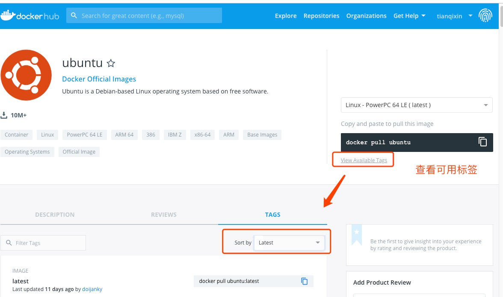
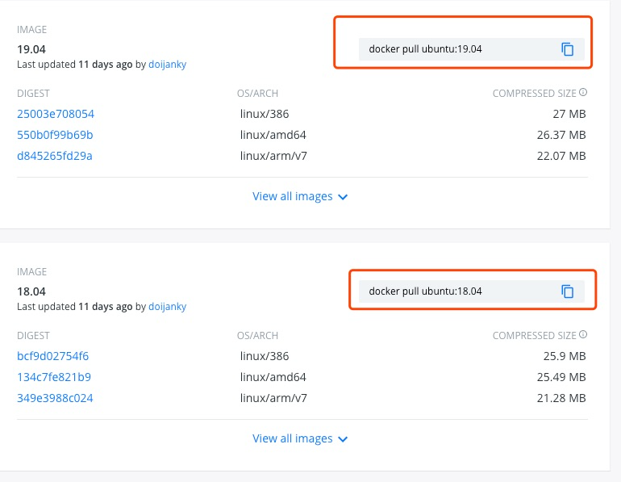
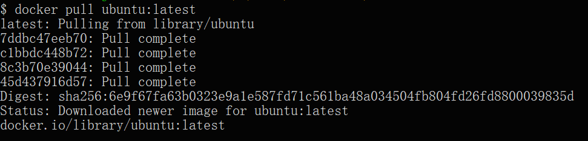
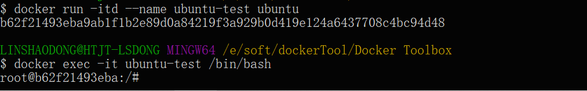
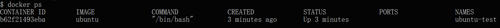

# Docker 安装 Ubuntu

Ubuntu 是基于 Debian 的 Linux 操作系统。

### 1、查看可用的 Ubuntu 版本
访问 Ubuntu 镜像库地址： [https://hub.docker.com/_/ubuntu?tab=tags&page=1](https://hub.docker.com/_/ubuntu?tab=tags&page=1)。

可以通过 Sort by 查看其他版本的 Ubuntu。默认是最新版本 ubuntu:latest 。



你也可以在下拉列表中找到其他你想要的版本：



### 2、拉取最新版的 Ubuntu 镜像

```shell
docker pull ubuntu
```

或者：

```shell
docker pull ubuntu:latest
```



### 3、查看本地镜像

```shell
docker images
```


在上图中可以看到我们已经安装了最新版本的 ubuntu。

### 4、运行容器，并且可以通过 exec 命令进入 ubuntu 容器

```shell
docker run -itd --name ubuntu-test ubuntu
$ docker exec -it ubuntu-test /bin/bash
```



### 5、安装成功

最后我们可以通过 `docker ps` 命令查看容器的运行信息：



