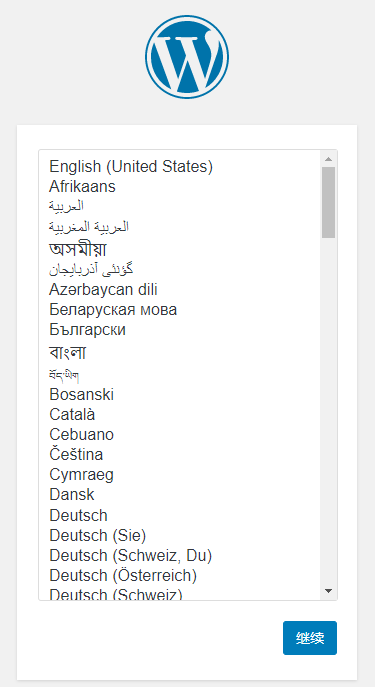
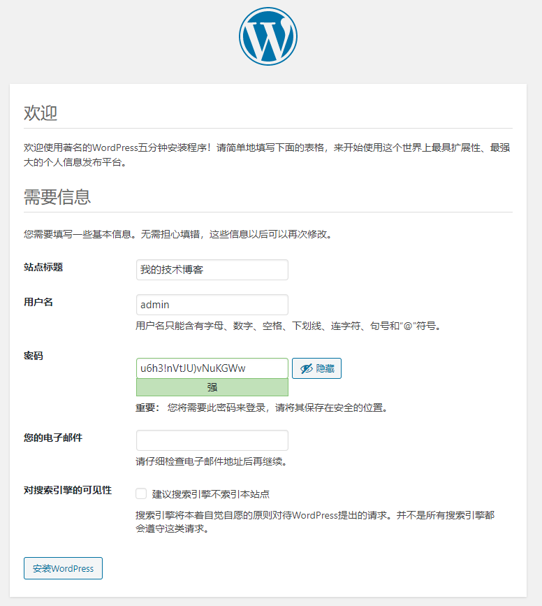
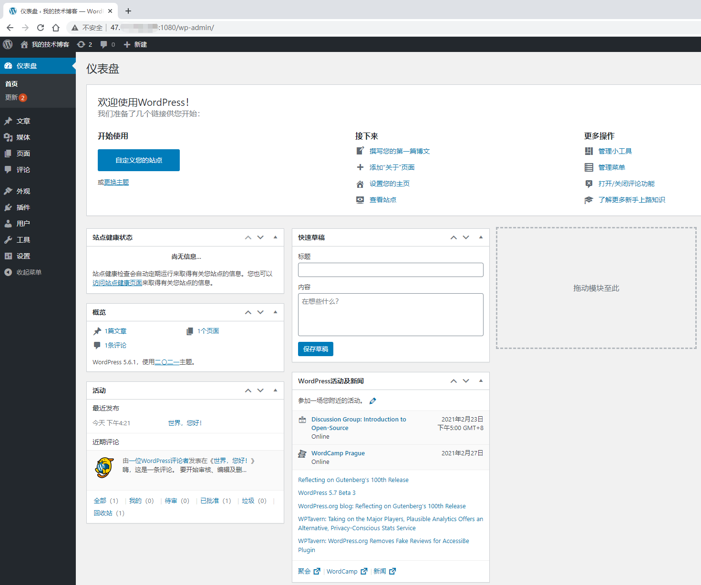
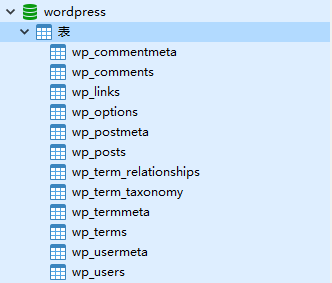
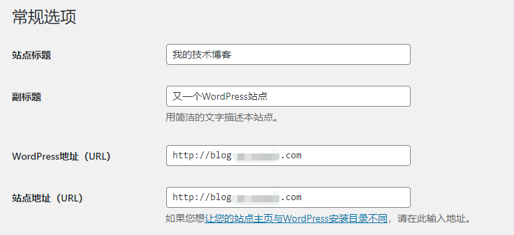

# Docker 安装 Wordpress

#### 一、拉镜像
镜像版本查看：[https://hub.docker.com/_/wordpress?tab=tags&page=1&ordering=last_updated](https://hub.docker.com/_/wordpress?tab=tags&page=1&ordering=last_updated)

```shell
docker pull wordpress:latest
```

#### 二、运行容器
```shell
docker run -d --name wordpress \
  -e TZ="Asia/Shanghai" \
  -e WORDPRESS_DB_HOST=127.0.0.1:3306 \
  -e WORDPRESS_DB_USER=root \
  -e WORDPRESS_DB_PASSWORD=password \
  -e WORDPRESS_DB_NAME=wordpress \
  -p 1080:80 \
  --restart=always \
  wordpress
```

运行完可以查看日志 `docker logs --tail 10 wordpress | grep info`

:::info
**参数说明：**

+ WORDPRESS_DB_HOST：mysql的IP+端口
+ WORDPRESS_DB_USER：mysq用户名
+ WORDPRESS_DB_PASSWORD：mysql密码
+ WORDPRESS_DB_NAME：数据库名，默认是wordpress
+ -p 1080:80 是指宿主机的1080端口映射容器的80端口，容器内端口80不要修改
+ restart=always 随docker的启动而启动

:::

#### 三、初始化配置
经过上述步骤 打开地址:[http://127.0.0.1:1080](http://127.0.0.1:1080/) 能看到以下页面就说明安装成功了  
  


设置管理员账号和密码，点击安装WordPress

  
  

安装成功后的后台管理页面，后台管理地址 [http://127.0.0.1:1080/wp-admin](http://127.0.0.1:1080/wp-admin)

  

数据库表结构  



#### 四、其他配置
4.1 绑定域名，设置->常规

  


4.2 更换域名，替换下面的www.old.com和www.new.com

```shell
UPDATE wp_options SET option_value=replace(option_value,'http://www.old.com','http://www.new.com') WHERE option_name in('home','siteurl');
UPDATE wp_posts SET post_content = replace(post_content,'http://www.old.com','http://www.new.com');
UPDATE wp_posts SET guid = replace(guid,'http://www.old.com','http://www.new.com');
```

