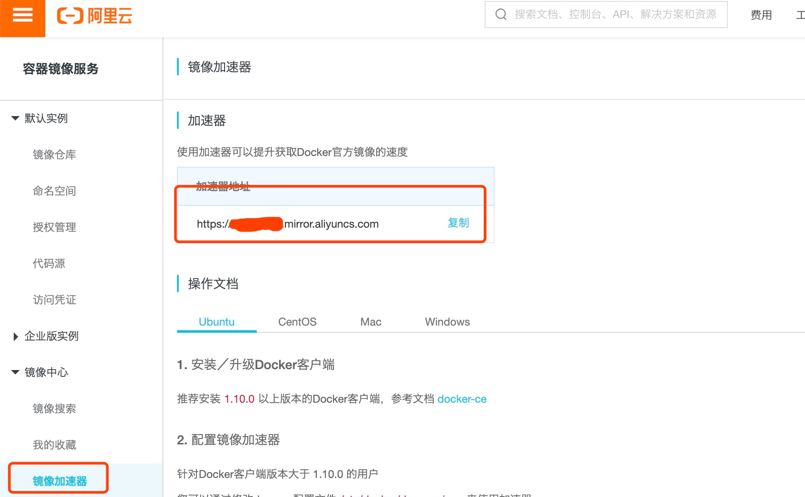
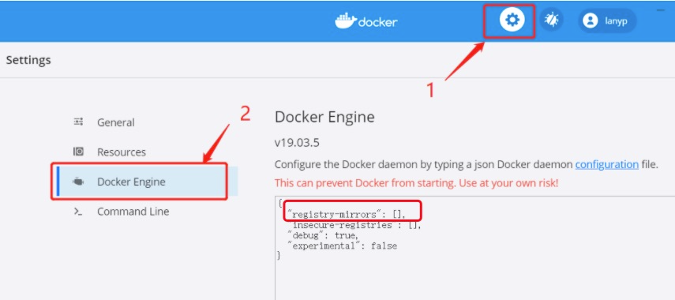
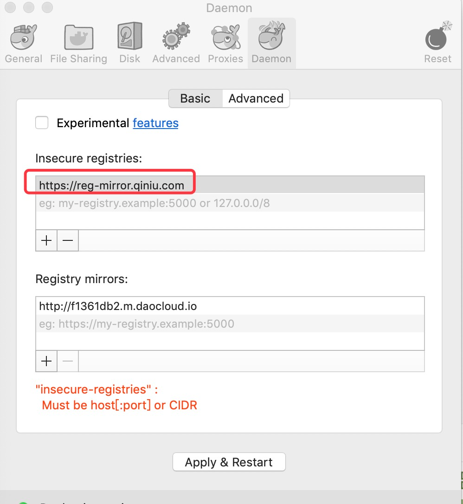

# Docker 国内镜像加速

国内从 DockerHub 拉取镜像有时会遇到困难，此时可以配置镜像加速器。

Docker 官方和国内很多云服务商都提供了国内加速器服务，例如：

+ **科大镜像**：[**https://docker.mirrors.ustc.edu.cn**](https://docker.mirrors.ustc.edu.cn)
+ ~~**网易（已关闭，不在推荐**）：[**https://hub-mirror.c.163.com**](https://hub-mirror.c.163.com)~~
+ 阿里云：**https://<你的ID>.mirror.aliyuncs.com**
+ **七牛云加速器**：[**https://reg-mirror.qiniu.com**](https://reg-mirror.qiniu.com)
+ **百度**：[**https://mirror.baidubce.com**](https://mirror.baidubce.com)
+ **上海交大**：[**https://docker.mirrors.sjtug.sjtu.edu.cn**](https://docker.mirrors.sjtug.sjtu.edu.cn)
+ **南京大学**：[**https://docker.nju.edu.cn**](https://docker.nju.edu.cn)
+ **Rainbond**: [**https://docker.rainbond.cc**](https://docker.rainbond.cc)
+ ~~**中国镜像加速（已关闭，不在推荐**）：[**https://registry.docker-cn.com**](https://registry.docker-cn.com)~~
+ ISCAS：[**https://mirror.iscas.ac.cn**](https://mirror.iscas.ac.cn/)
+ **清华大学镜像：**[**https://mirrors.tuna.tsinghua.edu.cn**](https://mirrors.tuna.tsinghua.edu.cn/)

当配置某一个加速器地址之后，若发现拉取不到镜像，请切换到另一个加速器地址。国内各大云服务商均提供了 Docker 镜像加速服务，建议根据运行 Docker 的云平台选择对应的镜像加速服务。

### 阿里云镜像加速器
阿里云镜像获取地址：[https://cr.console.aliyun.com/cn-hangzhou/instances/mirrors](https://cr.console.aliyun.com/cn-hangzhou/instances/mirrors)，登陆后，左侧菜单选中镜像加速器就可以看到你的专属地址了：



### 镜像加速器配置


#### Ubuntu14.04、Debian7Wheezy

对于使用 upstart 的系统而言，编辑 /etc/default/docker 文件，在其中的 DOCKER_OPTS 中配置加速器地址：

DOCKER_OPTS="--registry-mirror=https://docker-0.unsee.tech"

重新启动服务:

```shell
$ sudo service docker restart
```

#### Ubuntu16.04+、Debian8+、CentOS7

对于使用 systemd 的系统，创建或修改 /etc/docker/daemon.json  文件 

```shell
sudo vi /etc/docker/daemon.json
```

在文件里写入如下内容：

```json
{
  "registry-mirrors": ["https://docker-0.unsee.tech"]
}
```

#### 完美配置说明——重点


```text
----------------------等级1----------------------
"https://docker.rainbond.cc",
"https://reg-mirror.qiniu.com",
"https://mirror.baidubce.com",
"https://docker.mirrors.sjtug.sjtu.edu.cn",
"https://mirror.iscas.ac.cn",
"https://docker.m.daocloud.io",
"https://docker.imgdb.de",
"https://docker-0.unsee.tech",
"https://docker.nju.edu.cn",

----------------------等级2----------------------

"https://6kx4zyno.mirror.aliyuncs.com",
"https://almtd3fa.mirror.aliyuncs.com",

----------------------等级3----------------------

"https://mirrors.tuna.tsinghua.edu.cn",
"https://docker.mirrors.ustc.edu.cn",

```

> 说明：上面镜像加速，都是以 **docker pull node:20-alpine** 拉取node:20-alpine为例  
> 等级1：代表加速器访问流畅  
> 等级2：代表第三方个人的加速器  
> 等级3：代表可以访问部分镜像资源，部分包会存在下载成功，读取错误，导致镜像无法拉取  

一条龙完美配置

```json
{
  "registry-mirrors": [
    "https://docker.rainbond.cc",
    "https://reg-mirror.qiniu.com",
    "https://mirror.baidubce.com",
    "https://docker.mirrors.sjtug.sjtu.edu.cn",
    "https://mirror.iscas.ac.cn",
    "https://docker.m.daocloud.io",
    "https://docker.imgdb.de",
    "https://docker-0.unsee.tech",
    "https://docker.nju.edu.cn",

    "https://6kx4zyno.mirror.aliyuncs.com",
    "https://almtd3fa.mirror.aliyuncs.com",

    "https://mirrors.tuna.tsinghua.edu.cn",
    "https://docker.mirrors.ustc.edu.cn"
  ]
}
```


```shell
$ sudo systemctl daemon-reload
$ sudo systemctl restart docker
```

#### Windows 10
对于使用 Windows 10 的系统，在系统右下角托盘 Docker 图标内右键菜单选择 Settings，打开配置窗口后左侧导航菜单选择 Daemon。在 Registrymirrors 一栏中填写加速器地址 **https://docker.mirrors.ustc.edu.cn/** ，之后点击 Apply 保存后 Docker 就会重启并应用配置的镜像地址了。



windows 桌面端的Docker Engine配置文件所在目录为 `C:\Users\Administrator\.docker\daemon.json`

> [!CAUTION] 注意：
> 特别是在Windows配置Docker Engine镜像源时， 要保证json语法正确，否则会导致，Docker守护进程启动失败  
> 解决方式：手动修改`C:\Users\Administrator\.docker\daemon.json`改为正确的json语法，重启Docker Desktop 应用程序即可


#### Mac OS X
对于使用 Mac OS X 的用户，在任务栏点击 Docker for mac 应用图标-> Perferences...-> Daemon-> Registrymirrors。在列表中填写加速器地址 **https://reg-mirror.qiniu.com** 。修改完成之后，点击 Apply&Restart 按钮，Docker 就会重启并应用配置的镜像地址了。



### 检查加速器是否生效
检查加速器是否生效配置加速器之后，如果拉取镜像仍然十分缓慢，请手动检查加速器配置是否生效，在命令行执行 **docker info**，如果从结果中看到了如下内容，说明配置成功。

```shell
docker info
Registry Mirrors:
    https://reg-mirror.qiniu.com
```

### 镜像加速原理

Docker 的镜像源地址配置遵循​​从上到下依次尝试​​的机制。当配置多个镜像源时，Docker 会按照配置文件中定义的顺序依次尝试连接，若某个镜像源不可用（如超时或返回错误），则会自动尝试下一个镜像源，直到成功拉取镜像或所有源均失败为止。

但有的时候，如果 Docker 在下载镜像过程中遇到文件读取失败（例如镜像损坏、存储介质故障或权限问题），通常会直接终止操作并报错，而不会继续尝试其他镜像源，如：`https://mirrors.tuna.tsinghua.edu.cn`。


