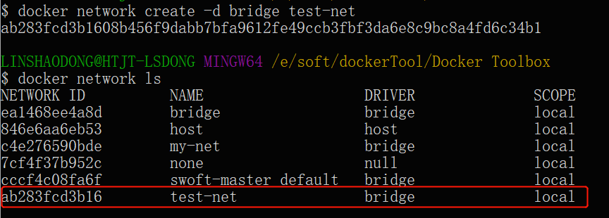
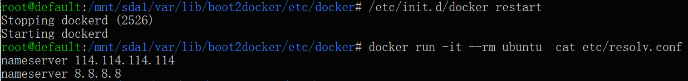
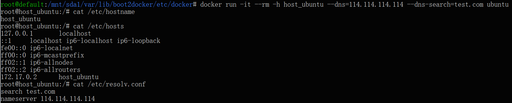
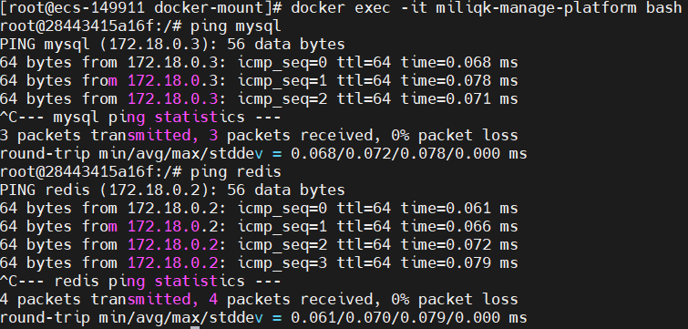

# Docker 容器连接

前面我们实现了通过网络端口来访问运行在 docker 容器内的服务。

容器中可以运行一些网络应用，要让外部也可以访问这些应用，可以通过 **-P** 或 **-p** 参数来指定端口映射。

下面我们来实现通过端口连接到一个 docker 容器。

---

## 网络端口映射
我们创建了一个 python 应用的容器。

```shell
docker run -d -P training/webapp python app.py
fce072cc88cee71b1cdceb57c2821d054a4a59f67da6b416fceb5593f059fc6d
```

另外，我们可以指定容器绑定的网络地址，比如绑定 127.0.0.1。

我们使用 **-P** 绑定端口号，使用 **docker ps** 可以看到容器端口 5000 绑定主机端口 32768。

```shell
docker ps
CONTAINER ID    IMAGE               COMMAND            ...           PORTS                     NAMES
fce072cc88ce    training/webapp     "python app.py"    ...     0.0.0.0:32768->5000/tcp   grave_hopper
```

我们也可以使用 **-p** 标识来指定容器端口绑定到主机端口。

两种方式的区别是:

+ **-P：**是容器内部端口**随机**映射到主机的端口。
+ **-p：**是容器内部端口绑定到**指定**的主机端口。

```shell
docker run -d -p 5000:5000 training/webapp python app.py
33e4523d30aaf0258915c368e66e03b49535de0ef20317d3f639d40222ba6bc0
```

```shell
docker ps
CONTAINER ID        IMAGE               COMMAND           ...           PORTS                     NAMES
33e4523d30aa        training/webapp     "python app.py"   ...   0.0.0.0:5000->5000/tcp    berserk_bartik
fce072cc88ce        training/webapp     "python app.py"   ...   0.0.0.0:32768->5000/tcp   grave_hopper
```

另外，我们可以指定容器绑定的网络地址，比如绑定 127.0.0.1。

```shell
docker run -d -p 127.0.0.1:5001:5000 training/webapp python app.py
95c6ceef88ca3e71eaf303c2833fd6701d8d1b2572b5613b5a932dfdfe8a857c
$ docker ps
CONTAINER ID        IMAGE               COMMAND           ...     PORTS                                NAMES
95c6ceef88ca        training/webapp     "python app.py"   ...  5000/tcp, 127.0.0.1:5001->5000/tcp   adoring_stonebraker
33e4523d30aa        training/webapp     "python app.py"   ...  0.0.0.0:5000->5000/tcp               berserk_bartik
fce072cc88ce        training/webapp     "python app.py"   ...    0.0.0.0:32768->5000/tcp              grave_hopper
```

这样我们就可以通过访问 127.0.0.1:5001 来访问容器的 5000 端口。

上面的例子中，默认都是绑定 tcp 端口，如果要绑定 UDP 端口，可以在端口后面加上 **/udp**。

```shell
docker run -d -p 127.0.0.1:5000:5000/udp training/webapp python app.py
6779686f06f6204579c1d655dd8b2b31e8e809b245a97b2d3a8e35abe9dcd22a
$ docker ps
CONTAINER ID        IMAGE               COMMAND           ...   PORTS                                NAMES
6779686f06f6        training/webapp     "python app.py"   ...   5000/tcp, 127.0.0.1:5000->5000/udp   drunk_visvesvaraya
95c6ceef88ca        training/webapp     "python app.py"   ...    5000/tcp, 127.0.0.1:5001->5000/tcp   adoring_stonebraker
33e4523d30aa        training/webapp     "python app.py"   ...     0.0.0.0:5000->5000/tcp               berserk_bartik
fce072cc88ce        training/webapp     "python app.py"   ...    0.0.0.0:32768->5000/tcp              grave_hopper
```

**docker port** 命令可以让我们快捷地查看端口的绑定情况。

```shell
docker port adoring_stonebraker 5000
127.0.0.1:5001
```

---

## Docker 网络bridge网桥模式实现容器互联

端口映射并不是唯一把 docker 连接到另一个容器的方法。

docker 有一个连接系统允许将多个容器连接在一起，共享连接信息。

docker 连接会创建一个父子关系，其中父容器可以看到子容器的信息。

---

### 容器命名
当我们创建一个容器的时候，docker 会自动对它进行命名。另外，我们也可以使用 **--name** 标识来命名容器，例如：

```shell
$  docker run -d -P --name tuonioooo training/webapp python app.py
43780a6eabaaf14e590b6e849235c75f3012995403f97749775e38436db9a441
```

我们可以使用 **docker ps** 命令来查看容器名称。

```shell
docker ps -l
CONTAINER ID     IMAGE            COMMAND           ...    PORTS                     NAMES
43780a6eabaa     training/webapp   "python app.py"  ...     0.0.0.0:32769->5000/tcp   tuonioooo
```

### 新建网络
下面先创建一个新的 Docker 网络。

```shell
docker network create -d bridge docker-mount_default

[root@ecs-149911 ~]# docker network ls
NETWORK ID     NAME                   DRIVER    SCOPE
f297f786d4b5   bridge                 bridge    local
c3509a01b631   docker-mount_default   bridge    local
f7f0029f747b   host                   host      local
454e6fbe8a40   none                   null      local
```



参数说明：

**-d**：参数指定 Docker 网络类型，有 bridge、overlay。

其中 overlay 网络类型用于 Swarm mode，在本小节中你可以忽略它。

### 连接容器
运行一个容器并连接到新建的 `docker-mount_default` 网络:

```shell
# 创建mysql容器并加入到 `docker-mount_default` 网络
docker run -p 3367:3306 \
--name mysql02 \
-e MYSQL_ROOT_PASSWORD=123456 \
-v /home/mysql02/data:/var/lib/mysql \
--net docker-mount_default \
-d mysql
```

打开新的终端，再运行一个容器并加入到 `docker-mount_default` 网络:

```shell
# 创建Java容器并加入到 `docker-mount_default` 网络
docker run -p 9330:9330 --name miliqk-manage-platform \ #容器的名称
-e TZ="Asia/Shanghai" \
-e APP_PROFILE=dev \
-v /etc/localtime:/etc/localtime \
-v /home/daizhao/apps/miliqk-manage-platform/logs:/logs \
--net docker-mount_default \ 
-d miliqk-manage-platform:0.0.1-SNAPSHOT #镜像名称:版本
```

进入到miliqk-manage-platform容器 ping mysql02 查看效果

```shell
docker exec -it miliqk-manage-platform bash
root@28443415a16f:/# ping mysql02
PING mysql (172.18.0.3): 56 data bytes
64 bytes from 172.18.0.3: icmp_seq=0 ttl=64 time=0.065 ms
64 bytes from 172.18.0.3: icmp_seq=1 ttl=64 time=0.084 ms
64 bytes from 172.18.0.3: icmp_seq=2 ttl=64 time=0.082 ms
64 bytes from 172.18.0.3: icmp_seq=3 ttl=64 time=0.097 ms
```

进入到mysql02容器 ping miliqk-manage-platform 查看效果

```shell
[root@ecs-149911 ~]# docker exec -it mysql02 bash
root@ecf2f7975ad8:/# ping miliqk-manage-platform
PING miliqk-manage-platform (172.18.0.5) 56(84) bytes of data.
64 bytes from miliqk-manage-platform.docker-mount_default (172.18.0.5): icmp_seq=1 ttl=64 time=0.077 ms
64 bytes from miliqk-manage-platform.docker-mount_default (172.18.0.5): icmp_seq=2 ttl=64 time=0.058 ms
64 bytes from miliqk-manage-platform.docker-mount_default (172.18.0.5): icmp_seq=3 ttl=64 time=0.057 ms
```

容器内中无 ping 命令，则在容器内执行以下命令安装 ping。

```shell
apt-get update
apt install iputils-ping
```

两者都可以互ping通，说明两个容器互联成功，也可以通过ip访问，容器的ip如何查看

```shell
#检查`docker-mount_default`网络的详情
docker network inspect docker-mount_default
#....other
"Containers": {
            "28443415a16f053ddbe577efb9bfa00df2241395fd84506b6adcf47aee6214b4": {
                "Name": "miliqk-manage-platform",
                "EndpointID": "23c52d4d23198386c2737197f45c7d67ae0fd97d9c8b452360cbd794c5c0fc7d",
                "MacAddress": "02:42:ac:12:00:05",
                "IPv4Address": "172.18.0.5/16",
                "IPv6Address": ""
            },
            "ecf2f7975ad813ce34241b465596699e722808f4f37d9b99dc65c87397c0a28a": {
                "Name": "mysql02",
                "EndpointID": "ad4fc6d96de58bcb33506be09713cb451acf4731b31449c5911e8a46a82446bf",
                "MacAddress": "02:42:ac:12:00:06",
                "IPv4Address": "172.18.0.6/16",
                "IPv6Address": ""
            }
#....other
```
通过以上命令，可以查看到每一个容器所在网络中的ip，进入到容器miliqk-manage-platform用ip访问mysql02

```shell
docker exec -it miliqk-manage-platform bash
root@28443415a16f:/# ping 172.18.0.6
PING 172.18.0.6 (172.18.0.6): 56 data bytes
64 bytes from 172.18.0.6: icmp_seq=0 ttl=64 time=0.090 ms
64 bytes from 172.18.0.6: icmp_seq=1 ttl=64 time=0.072 ms
64 bytes from 172.18.0.6: icmp_seq=2 ttl=64 time=0.085 ms
64 bytes from 172.18.0.6: icmp_seq=3 ttl=64 time=0.071 ms
```

如果你有多个容器之间需要互相连接，推荐使用 Docker Compose，后面会介绍。

删除一个网络的命令

```shell
docker network rm [networkID/NAME]
```


---

## 配置 DNS
我们可以在宿主机的 /etc/docker/daemon.json 文件中增加以下内容来设置全部容器的 DNS：

```json
{
  "dns" : [
    "114.114.114.114",
    "8.8.8.8"
  ]
}
```

设置后，启动容器的 DNS 会自动配置为 114.114.114.114 和 8.8.8.8。

配置完，需要重启 docker 才能生效。

查看容器的 DNS 是否生效可以使用以下命令，它会输出容器的 DNS 信息：

```shell
docker run -it --rm  ubuntu  cat etc/resolv.conf
```

点击图片查看大图：



**手动指定容器的配置**

如果只想在指定的容器设置 DNS，则可以使用以下命令：

```shell
docker run -it --rm -h host_ubuntu  --dns=114.114.114.114 --dns-search=test.com ubuntu
```

参数说明：

**--rm**：容器退出时自动清理容器内部的文件系统。

**-h HOSTNAME 或者 --hostname=HOSTNAME**： 设定容器的主机名，它会被写到容器内的 /etc/hostname 和 /etc/hosts。

**--dns=IP_ADDRESS**： 添加 DNS 服务器到容器的 /etc/resolv.conf 中，让容器用这个服务器来解析所有不在 /etc/hosts 中的主机名。

**--dns-search=DOMAIN**： 设定容器的搜索域，当设定搜索域为 .example.com 时，在搜索一个名为 host 的主机时，DNS 不仅搜索 host，还会搜索 host.example.com。

点击图片查看大图：



如果在容器启动时没有指定 **--dns** 和 **--dns-search**，Docker 会默认用宿主主机上的 /etc/resolv.conf 来配置容器的 DNS。


## --link容器互联

启动redis容器，暴露端口 6379

```shell
docker run -itd --name redis -p 6379:6379 redis
```

启动mysql容器，暴露端口 3306

```shell
docker run -p 3306:3306 \
--name mysql \ #容器名
-e MYSQL_ROOT_PASSWORD=root \ #设置root账号密码
-v /mnt/docker-mnt/mysql/data:/var/lib/mysql \
-d mysql
```

`miliqk-manage-platform` 是一个已知创建好的容器 ，启动Java容器，通过--link 链接 mysql、redis容器

```shell
docker run -p 9330:9330 --name miliqk-manage-platform \ #容器的名称
-e TZ="Asia/Shanghai" \
-e APP_PROFILE=dev \
-v /etc/localtime:/etc/localtime \
-v /home/daizhao/apps/miliqk-manage-platform/logs:/logs \
--link mysql:db \ #容器名:别名
--link redis \
-d miliqk-manage-platform:0.0.1-SNAPSHOT #镜像名称:版本
```




`application.yml`配置数据源说明

```
jdbc:mysql://db:3306/miliqk_mp?serverTimezone=Asia/Shanghai&useUnicode=true&characterEncoding=utf8&useSSL=false&allowMultiQueries=true
```

> `db` 是容器的别名，同时也可以用 容器名 `mysql`，或用 `mysql` 容器的ip  
> `3306` 是容器的端口号，不是对外暴露的端口切记
