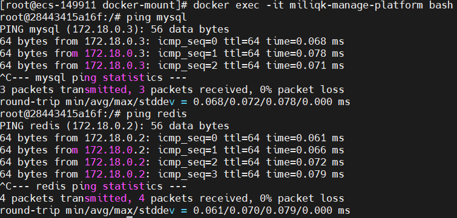

# Docker 容器连接

前面我们实现了通过网络端口来访问运行在 docker 容器内的服务。

容器中可以运行一些网络应用，要让外部也可以访问这些应用，可以通过 **-P** 或 **-p** 参数来指定端口映射。

下面我们来实现通过端口连接到一个 docker 容器。

---

## 网络端口映射
我们创建了一个 python 应用的容器。

```plain
tuonioooo@ecs:~$ docker run -d -P training/webapp python app.py
fce072cc88cee71b1cdceb57c2821d054a4a59f67da6b416fceb5593f059fc6d
```

另外，我们可以指定容器绑定的网络地址，比如绑定 127.0.0.1。

我们使用 **-P** 绑定端口号，使用 **docker ps** 可以看到容器端口 5000 绑定主机端口 32768。

```plain
tuonioooo@ecs:~$ docker ps
CONTAINER ID    IMAGE               COMMAND            ...           PORTS                     NAMES
fce072cc88ce    training/webapp     "python app.py"    ...     0.0.0.0:32768->5000/tcp   grave_hopper
```

我们也可以使用 **-p** 标识来指定容器端口绑定到主机端口。

两种方式的区别是:

+ **-P：**是容器内部端口**随机**映射到主机的端口。
+ **-p：**是容器内部端口绑定到**指定**的主机端口。

```plain
tuonioooo@ecs:~$ docker run -d -p 5000:5000 training/webapp python app.py
33e4523d30aaf0258915c368e66e03b49535de0ef20317d3f639d40222ba6bc0
```

```plain
tuonioooo@ecs:~$ docker ps
CONTAINER ID        IMAGE               COMMAND           ...           PORTS                     NAMES
33e4523d30aa        training/webapp     "python app.py"   ...   0.0.0.0:5000->5000/tcp    berserk_bartik
fce072cc88ce        training/webapp     "python app.py"   ...   0.0.0.0:32768->5000/tcp   grave_hopper
```

另外，我们可以指定容器绑定的网络地址，比如绑定 127.0.0.1。

```plain
tuonioooo@ecs:~$ docker run -d -p 127.0.0.1:5001:5000 training/webapp python app.py
95c6ceef88ca3e71eaf303c2833fd6701d8d1b2572b5613b5a932dfdfe8a857c
tuonioooo@ecs:~$ docker ps
CONTAINER ID        IMAGE               COMMAND           ...     PORTS                                NAMES
95c6ceef88ca        training/webapp     "python app.py"   ...  5000/tcp, 127.0.0.1:5001->5000/tcp   adoring_stonebraker
33e4523d30aa        training/webapp     "python app.py"   ...  0.0.0.0:5000->5000/tcp               berserk_bartik
fce072cc88ce        training/webapp     "python app.py"   ...    0.0.0.0:32768->5000/tcp              grave_hopper
```

这样我们就可以通过访问 127.0.0.1:5001 来访问容器的 5000 端口。

上面的例子中，默认都是绑定 tcp 端口，如果要绑定 UDP 端口，可以在端口后面加上 **/udp**。

```plain
tuonioooo@ecs:~$ docker run -d -p 127.0.0.1:5000:5000/udp training/webapp python app.py
6779686f06f6204579c1d655dd8b2b31e8e809b245a97b2d3a8e35abe9dcd22a
tuonioooo@ecs:~$ docker ps
CONTAINER ID        IMAGE               COMMAND           ...   PORTS                                NAMES
6779686f06f6        training/webapp     "python app.py"   ...   5000/tcp, 127.0.0.1:5000->5000/udp   drunk_visvesvaraya
95c6ceef88ca        training/webapp     "python app.py"   ...    5000/tcp, 127.0.0.1:5001->5000/tcp   adoring_stonebraker
33e4523d30aa        training/webapp     "python app.py"   ...     0.0.0.0:5000->5000/tcp               berserk_bartik
fce072cc88ce        training/webapp     "python app.py"   ...    0.0.0.0:32768->5000/tcp              grave_hopper
```

**docker port** 命令可以让我们快捷地查看端口的绑定情况。

```plain
tuonioooo@ecs:~$ docker port adoring_stonebraker 5000
127.0.0.1:5001
```

---

## Docker 网络bridge网桥模式实现容器互联
端口映射并不是唯一把 docker 连接到另一个容器的方法。

docker 有一个连接系统允许将多个容器连接在一起，共享连接信息。

docker 连接会创建一个父子关系，其中父容器可以看到子容器的信息。

---

### 容器命名
当我们创建一个容器的时候，docker 会自动对它进行命名。另外，我们也可以使用 **--name** 标识来命名容器，例如：

```plain
tuonioooo@ecs:~$  docker run -d -P --name runoob training/webapp python app.py
43780a6eabaaf14e590b6e849235c75f3012995403f97749775e38436db9a441
```

我们可以使用 **docker ps** 命令来查看容器名称。

```plain
tuonioooo@ecs:~$ docker ps -l
CONTAINER ID     IMAGE            COMMAND           ...    PORTS                     NAMES
43780a6eabaa     training/webapp   "python app.py"  ...     0.0.0.0:32769->5000/tcp   runoob
```

### 新建网络
下面先创建一个新的 Docker 网络。$ docker network create -d bridge test-net


参数说明：

**-d**：参数指定 Docker 网络类型，有 bridge、overlay。

其中 overlay 网络类型用于 Swarm mode，在本小节中你可以忽略它。

### 连接容器
运行一个容器并连接到新建的 test-net 网络:

$ docker run -itd --name test1 --network test-net ubuntu /bin/bash

打开新的终端，再运行一个容器并加入到 test-net 网络:

$ docker run -itd --name test2 --network test-net ubuntu /bin/bash

点击图片查看大图：


下面通过 ping 来证明 test1 容器和 test2 容器建立了互联关系。

如果 test1、test2 容器内中无 ping 命令，则在容器内执行以下命令安装 ping（即学即用：可以在一个容器里安装好，提交容器到镜像，在以新的镜像重新运行以上俩个容器）。

```plain
apt-get update
apt install iputils-ping
```

在 test1 容器输入以下命令：

点击图片查看大图：


同理在 test2 容器也会成功连接到:

点击图片查看大图：


这样，test1 容器和 test2 容器建立了互联关系。

如果你有多个容器之间需要互相连接，推荐使用 Docker Compose，后面会介绍。

---

## 配置 DNS
我们可以在宿主机的 /etc/docker/daemon.json 文件中增加以下内容来设置全部容器的 DNS：

```plain
{
  "dns" : [
    "114.114.114.114",
    "8.8.8.8"
  ]
}
```

设置后，启动容器的 DNS 会自动配置为 114.114.114.114 和 8.8.8.8。

配置完，需要重启 docker 才能生效。

查看容器的 DNS 是否生效可以使用以下命令，它会输出容器的 DNS 信息：

$ docker run -it --rm  ubuntu  cat etc/resolv.conf

点击图片查看大图：


**手动指定容器的配置**

如果只想在指定的容器设置 DNS，则可以使用以下命令：

$ docker run -it --rm -h host_ubuntu  --dns=114.114.114.114 --dns-search=test.com ubuntu

参数说明：

**--rm**：容器退出时自动清理容器内部的文件系统。

**-h HOSTNAME 或者 --hostname=HOSTNAME**： 设定容器的主机名，它会被写到容器内的 /etc/hostname 和 /etc/hosts。

**--dns=IP_ADDRESS**： 添加 DNS 服务器到容器的 /etc/resolv.conf 中，让容器用这个服务器来解析所有不在 /etc/hosts 中的主机名。

**--dns-search=DOMAIN**： 设定容器的搜索域，当设定搜索域为 .example.com 时，在搜索一个名为 host 的主机时，DNS 不仅搜索 host，还会搜索 host.example.com。

点击图片查看大图：


如果在容器启动时没有指定 **--dns** 和 **--dns-search**，Docker 会默认用宿主主机上的 /etc/resolv.conf 来配置容器的 DNS。


## --link容器互联



`application.yml`配置数据源说明

```
jdbc:mysql://db:3306/miliqk_mp?serverTimezone=Asia/Shanghai&useUnicode=true&characterEncoding=utf8&useSSL=false&allowMultiQueries=true
```

> `db` 是容器的别名，同时也可以用 容器名 `mysql`，或用 `mysql` 容器的ip  
> `3306` 是容器的端口号，不是对外暴露的端口切记
