# Docker 容器使用

Docker 容器是一个轻量级、可移植、自给自足的软件环境，用于运行应用程序。

Docker 容器将应用程序及其所有依赖项（包括库、配置文件、系统工具等）封装在一个标准化的包中，使得应用能够在任何地方一致地运行。

容器是操作系统级别的虚拟化，不需要运行完整的操作系统，启动和运行更为高效。

### 镜像与容器的关系

+ **镜像（Image）**：容器的静态模板，包含了应用程序运行所需的所有依赖和文件。镜像是不可变的。
+ **容器（Container）**：镜像的一个运行实例，具有自己的文件系统、进程、网络等，且是动态的。容器从镜像启动，并在运行时保持可变。

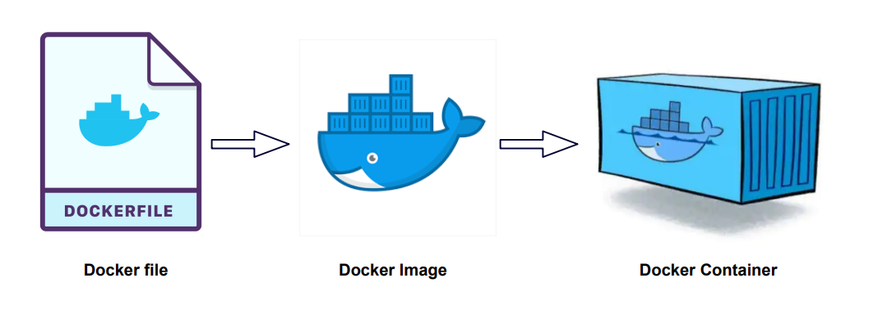

---

## Docker 客户端

Docker 客户端是与 Docker 守护进程（Docker Daemon）交互的命令行工具。

docker 客户端非常简单，我们可以直接输入 docker 命令来查看到 Docker 客户端的所有命令选项。

```shell
docker
```

输出

```shell
Usage:  docker [OPTIONS] COMMAND

A self-sufficient runtime for containers

Common Commands:
  run         Create and run a new container from an image
  exec        Execute a command in a running container
  ps          List containers
  build       Build an image from a Dockerfile
  pull        Download an image from a registry
  push        Upload an image to a registry
  images      List images
  login       Log in to a registry
  logout      Log out from a registry
  search      Search Docker Hub for images
  version     Show the Docker version information
  info        Display system-wide information

Management Commands:
  builder     Manage builds
  buildx*     Docker Buildx (Docker Inc., v0.11.2)
  checkpoint  Manage checkpoints
  compose*    Docker Compose (Docker Inc., v2.21.0)
  container   Manage containers
  context     Manage contexts
  image       Manage images
  manifest    Manage Docker image manifests and manifest lists
  network     Manage networks
  plugin      Manage plugins
  system      Manage Docker
  trust       Manage trust on Docker images
  volume      Manage volumes

Swarm Commands:
  config      Manage Swarm configs
  node        Manage Swarm nodes
  secret      Manage Swarm secrets
  service     Manage Swarm services
  stack       Manage Swarm stacks
  swarm       Manage Swarm

Commands:
  attach      Attach local standard input, output, and error streams to a running container
  commit      Create a new image from a container's changes
  cp          Copy files/folders between a container and the local filesystem
  create      Create a new container
  diff        Inspect changes to files or directories on a container's filesystem
  events      Get real time events from the server
  export      Export a container's filesystem as a tar archive
  history     Show the history of an image
  import      Import the contents from a tarball to create a filesystem image
  inspect     Return low-level information on Docker objects
  kill        Kill one or more running containers
  load        Load an image from a tar archive or STDIN
  logs        Fetch the logs of a container
  pause       Pause all processes within one or more containers
  port        List port mappings or a specific mapping for the container
  rename      Rename a container
  restart     Restart one or more containers
  rm          Remove one or more containers
  rmi         Remove one or more images
  save        Save one or more images to a tar archive (streamed to STDOUT by default)
  start       Start one or more stopped containers
  stats       Display a live stream of container(s) resource usage statistics
  stop        Stop one or more running containers
  tag         Create a tag TARGET_IMAGE that refers to SOURCE_IMAGE
  top         Display the running processes of a container
  unpause     Unpause all processes within one or more containers
  update      Update configuration of one or more containers
  wait        Block until one or more containers stop, then print their exit codes

Global Options:
      --config string      Location of client config files (default "/home/tuonioooo/.docker")
  -c, --context string     Name of the context to use to connect to the daemon (overrides DOCKER_HOST env var and default
                           context set with "docker context use")
  -D, --debug              Enable debug mode
  -H, --host list          Daemon socket to connect to
  -l, --log-level string   Set the logging level ("debug", "info", "warn", "error", "fatal") (default "info")
      --tls                Use TLS; implied by --tlsverify
      --tlscacert string   Trust certs signed only by this CA (default "/home/tuonioooo/.docker/ca.pem")
      --tlscert string     Path to TLS certificate file (default "/home/tuonioooo/.docker/cert.pem")
      --tlskey string      Path to TLS key file (default "/home/tuonioooo/.docker/key.pem")
      --tlsverify          Use TLS and verify the remote
  -v, --version            Print version information and quit

Run 'docker COMMAND --help' for more information on a command.

For more help on how to use Docker, head to https://docs.docker.com/go/guides/

```

可以通过命令 **docker command --help** 更深入的了解指定的 Docker 命令使用方法。

例如我们要查看 **docker stats** 指令的具体使用方法：

```shell
docker stats --help
```
输出

```shell
Usage:  docker stats [OPTIONS] [CONTAINER...]

Display a live stream of container(s) resource usage statistics

Aliases:
  docker container stats, docker stats

Options:
  -a, --all             Show all containers (default shows just running)
      --format string   Format output using a custom template:
                        'table':            Print output in table format with column headers (default)
                        'table TEMPLATE':   Print output in table format using the given Go template
                        'json':             Print in JSON format
                        'TEMPLATE':         Print output using the given Go template.
                        Refer to https://docs.docker.com/go/formatting/ for more information about formatting output with templates
      --no-stream       Disable streaming stats and only pull the first result
      --no-trunc        Do not truncate output
```

以下是常用的 Docker 客户端命令：

| **命令**                | **功能**                                  | **示例**                                     |
|-----------------------|-----------------------------------------|--------------------------------------------|
| `docker run`          | 启动一个新的容器并运行命令                           | `docker run -d ubuntu`                     |
| `docker ps`           | 列出当前正在运行的容器                             | `docker ps`                                |
| `docker ps -a`        | 列出所有容器（包括已停止的容器）                        | `docker ps -a`                             |
| `docker build`        | 使用 Dockerfile 构建镜像                      | `docker build -t my-image .`               |
| `docker images`       | 列出本地存储的所有镜像                             | `docker images`                            |
| `docker pull`         | 从 Docker 仓库拉取镜像                         | `docker pull ubuntu`                       |
| `docker push`         | 将镜像推送到 Docker 仓库                        | `docker push my-image`                     |
| `docker exec`         | 在运行的容器中执行命令                             | `docker exec -it container_name bash`      |
| `docker stop`         | 停止一个或多个容器                               | `docker stop container_name`               |
| `docker start`        | 启动已停止的容器                                | `docker start container_name`              |
| `docker restart`      | 重启一个容器                                  | `docker restart container_name`            |
| `docker rm`           | 删除一个或多个容器                               | `docker rm container_name`                 |
| `docker rmi`          | 删除一个或多个镜像                               | `docker rmi my-image`                      |
| `docker logs`         | 查看容器的日志                                 | `docker logs container_name`               |
| `docker inspect`      | 获取容器或镜像的详细信息                            | `docker inspect container_name`            |
| `docker exec -it`     | 进入容器的交互式终端                              | `docker exec -it container_name /bin/bash` |
| `docker network ls`   | 列出所有 Docker 网络                          | `docker network ls`                        |
| `docker volume ls`    | 列出所有 Docker 卷                           | `docker volume ls`                         |
| `docker-compose up`   | 启动多容器应用（从 `docker-compose.yml`<br/> 文件） | `docker-compose up`                        |
| `docker-compose down` | 停止并删除由 `docker-compose`<br/> 启动的容器、网络等  | `docker-compose down`                      |
| `docker info`         | 显示 Docker 系统的详细信息                       | `docker info`                              |
| `docker version`      | 显示 Docker 客户端和守护进程的版本信息                 | `docker version`                           |
| `docker stats`        | 显示容器的实时资源使用情况                           | `docker stats`                             |
| `docker login`        | 登录 Docker 仓库                            | `docker login`                             |
| `docker logout`       | 登出 Docker 仓库                            | `docker logout`                            |

**常用选项说明:**

+ `**-d**`：后台运行容器，例如 `docker run -d ubuntu`。
+ `**-it**`：以交互式终端运行容器，例如 `docker exec -it container_name bash`。
+ `**-t**`：为镜像指定标签，例如 `docker build -t my-image .`。

---

## 容器使用

### 获取镜像

如果我们本地没有 ubuntu 镜像，我们可以使用 docker pull 命令来载入 ubuntu 镜像：

```shell
docker pull ubuntu
```

### 启动容器

以下命令使用 ubuntu 镜像启动一个容器，参数为以命令行模式进入该容器：

```shell
docker run -it ubuntu /bin/bash
```

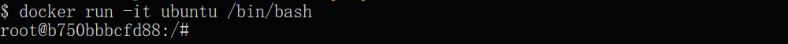

参数说明：

+ **-i**: 交互式操作。
+ **-t**: 终端。
+ **ubuntu**: ubuntu 镜像。
+ **/bin/bash**：放在镜像名后的是命令，这里我们希望有个交互式 Shell，因此用的是 /bin/bash。

要退出终端，直接输入 **exit**:

```shell
root@ed09e4490c57:/# exit
```

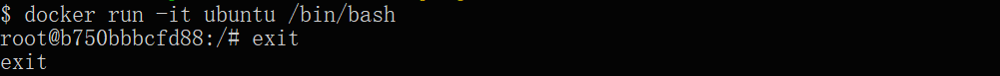

### 启动已停止运行的容器

查看所有的容器命令如下：

```shell
docker ps -a
```

点击图片查看大图：

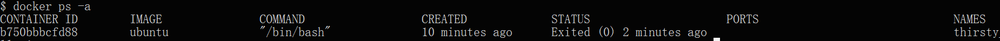

使用 docker start 启动一个已停止的容器：

```shell
docker start b750bbbcfd88
```

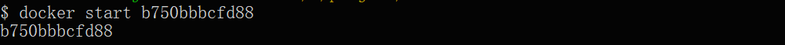

### 后台运行

在大部分的场景下，我们希望 docker 的服务是在后台运行的，我们可以过 **-d** 指定容器的运行模式。

```shell
docker run -itd --name ubuntu-test ubuntu /bin/bash
```

点击图片查看大图：

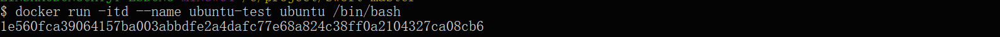

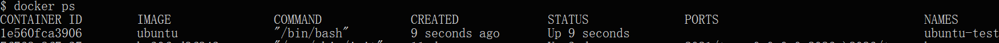

**注：**加了 **-d** 参数默认不会进入容器，想要进入容器需要使用指令** ****docker exec**（下面会介绍到）。

### 停止一个容器

停止容器的命令如下：

```shell
docker stop <容器 ID>
```


停止的容器可以通过 docker restart 重启：

```shell
docker restart <容器 ID>
```

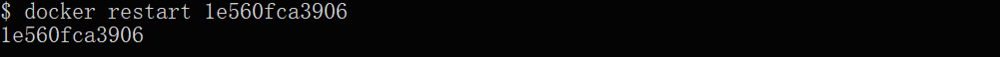

### 进入容器

在使用 **-d** 参数时启动容器时，容器会运行在后台，这时如果要进入容器，可以通过以下命令进入：

+ **docker attach**：允许你与容器的标准输入（stdin）、输出（stdout）和标准错误（stderr）进行交互。
+ **docker exec**：推荐大家使用 docker exec 命令，因为此命令会退出容器终端，但不会导致容器的停止。

**attach 命令**

使用 docker attach 命令实例：

```shell
docker attach 1e560fca3906
```

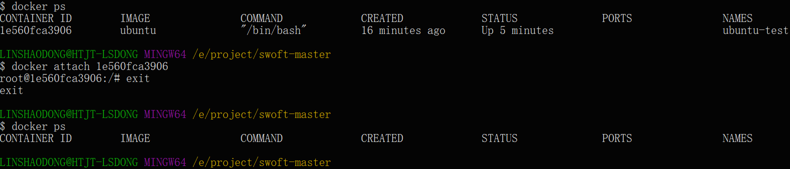

**注意：** 如果从这个容器退出，会导致容器的停止。

**exec 命令**

使用 docker exec 命令实例：

```shell
docker exec -it 243c32535da7 /bin/bash
```

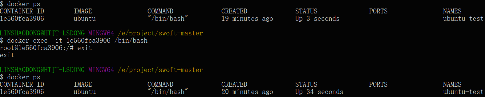

**注意：** 如果从这个容器退出，容器不会停止，这就是为什么推荐大家使用 **docker exec**。

更多参数说明请使用 **docker exec --help** 命令查看。

### 导出和导入容器

**导出容器**

如果要导出本地某个容器，可以使用 **docker export** 命令。

```shell
docker export 1e560fca3906 > ubuntu.tar
```

导出容器 1e560fca3906 快照到本地文件 ubuntu.tar。

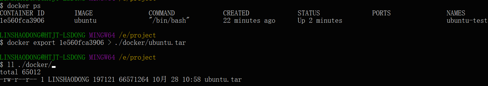

这样将导出容器快照到本地文件。

**导入容器快照**

可以使用 docker import 从容器快照文件中再导入为镜像，以下实例将快照文件 ubuntu.tar 导入到镜像 test/ubuntu:v1:

```shell
$ cat docker/ubuntu.tar | docker import - test/ubuntu:v1
```

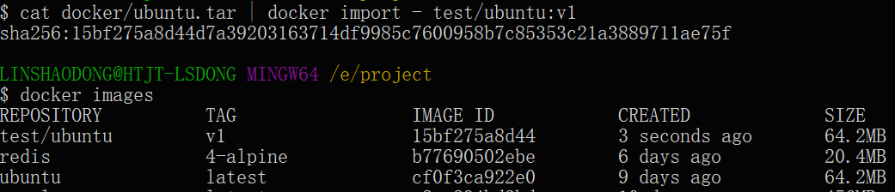

此外，也可以通过指定 URL 或者某个目录来导入，例如：

```shell
docker import http://example.com/exampleimage.tgz example/imagerepo
```

### 删除容器

删除容器使用 **docker rm** 命令：

```shell
docker rm -f 1e560fca3906
```

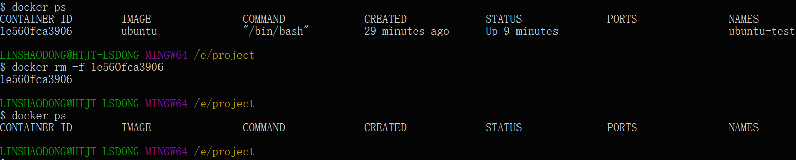

下面的命令可以清理掉所有处于终止状态的容器。

```shell
docker container prune
```

---

## 运行一个 web 应用

前面我们运行的容器并没有一些什么特别的用处。

接下来让我们尝试使用 docker 构建一个 web 应用程序。

我们将在docker容器中运行一个 Python Flask 应用来运行一个web应用。

```shell
docker pull training/webapp  # 载入镜像
$ docker run -d -P training/webapp python app.py
```

参数说明:

+ **-d:** 让容器在后台运行。
+ **-P:** 将容器内部使用的网络端口随机映射到我们使用的主机上。

---

## 查看 WEB 应用容器

使用 docker ps 来查看我们正在运行的容器：

```shell
$  docker ps
CONTAINER ID        IMAGE               COMMAND             ...        PORTS                 
d3d5e39ed9d3        training/webapp     "python app.py"     ...        0.0.0.0:32769->5000/tcp
```

这里多了端口信息。

```shell
PORTS
0.0.0.0:32769->5000/tcp
```

Docker 开放了 5000 端口（默认 Python Flask 端口）映射到主机端口 32769 上。

这时我们可以通过浏览器访问WEB应用


我们也可以通过 -p 参数来设置不一样的端口：

```shell
docker run -d -p 5000:5000 training/webapp python app.py
```

**docker ps** 查看正在运行的容器

```shell
$  docker ps
CONTAINER ID        IMAGE                             PORTS                     NAMES
bf08b7f2cd89        training/webapp     ...        0.0.0.0:5000->5000/tcp    wizardly_chandrasekhar
d3d5e39ed9d3        training/webapp     ...        0.0.0.0:32769->5000/tcp   xenodochial_hoov
```

容器内部的 5000 端口映射到我们本地主机的 5000 端口上。

---

## 网络端口的快捷方式

通过 **docker ps** 命令可以查看到容器的端口映射，**docker** 还提供了另一个快捷方式 **docker port**，使用 **docker port**
可以查看指定 （ID 或者名字）容器的某个确定端口映射到宿主机的端口号。

上面我们创建的 web 应用容器 ID 为 **bf08b7f2cd89** 名字为 **wizardly_chandrasekhar**。

我可以使用 **docker port bf08b7f2cd89** 或 **docker port wizardly_chandrasekhar** 来查看容器端口的映射情况。

```shell
docker port bf08b7f2cd89
5000/tcp -> 0.0.0.0:5000
```

```shell
docker port wizardly_chandrasekhar
5000/tcp -> 0.0.0.0:5000
```

---

## 查看 WEB 应用程序日志

docker logs [ID或者名字] 可以查看容器内部的标准输出。

```shell
docker logs -f bf08b7f2cd89
 * Running on http://0.0.0.0:5000/ (Press CTRL+C to quit)
192.168.239.1 - - [09/May/2016 16:30:37] "GET / HTTP/1.1" 200 -
192.168.239.1 - - [09/May/2016 16:30:37] "GET /favicon.ico HTTP/1.1" 404 -
```

**-f:** 让 **docker logs** 像使用 **tail -f** 一样来输出容器内部的标准输出。

从上面，我们可以看到应用程序使用的是 5000 端口并且能够查看到应用程序的访问日志。

---

## 查看WEB应用程序容器的进程

我们还可以使用 docker top 来查看容器内部运行的进程

```shell
docker top wizardly_chandrasekhar
UID     PID         PPID          ...       TIME                CMD
root    23245       23228         ...       00:00:00            python app.py
```

---

## 检查 WEB 应用程序

使用 **docker inspect** 来查看 Docker 的底层信息。它会返回一个 JSON 文件记录着 Docker 容器的配置和状态信息。

```shell
docker inspect wizardly_chandrasekhar
[
    {
        "Id": "bf08b7f2cd897b5964943134aa6d373e355c286db9b9885b1f60b6e8f82b2b85",
        "Created": "2018-09-17T01:41:26.174228707Z",
        "Path": "python",
        "Args": [
            "app.py"
        ],
        "State": {
            "Status": "running",
            "Running": true,
            "Paused": false,
            "Restarting": false,
            "OOMKilled": false,
            "Dead": false,
            "Pid": 23245,
            "ExitCode": 0,
            "Error": "",
            "StartedAt": "2018-09-17T01:41:26.494185806Z",
            "FinishedAt": "0001-01-01T00:00:00Z"
        },
......
```

---

## 停止 WEB 应用容器

```shell
docker stop wizardly_chandrasekhar   
wizardly_chandrasekhar
```

---

## 重启WEB应用容器

已经停止的容器，我们可以使用命令 docker start 来启动。

```shell
docker start wizardly_chandrasekhar
wizardly_chandrasekhar
```

docker ps -l 查询最后一次创建的容器：

```shell
#  docker ps -l 
CONTAINER ID        IMAGE                             PORTS                     NAMES
bf08b7f2cd89        training/webapp     ...        0.0.0.0:5000->5000/tcp    wizardly_chandrasekhar
```

正在运行的容器，我们可以使用 **docker restart** 命令来重启。

---

## 移除WEB应用容器

我们可以使用 docker rm 命令来删除不需要的容器

```shell
docker rm wizardly_chandrasekhar  
wizardly_chandrasekhar
```

删除容器时，容器必须是停止状态，否则会报如下错误

```shell
docker rm wizardly_chandrasekhar
Error response from daemon: You cannot remove a running container bf08b7f2cd897b5964943134aa6d373e355c286db9b9885b1f60b6e8f82b2b85. Stop the container before attempting removal or force remove
```

