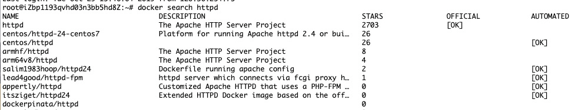
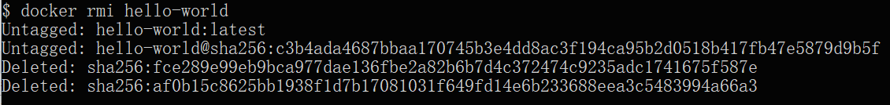

# Docker 镜像使用

当运行容器时，使用的镜像如果在本地中不存在，docker 就会自动从 docker 镜像仓库中下载，默认是从 Docker Hub 公共镜像源下载。

下面我们来学习：

+ 1、管理和使用本地 Docker 主机镜像
+ 2、创建镜像

---

## 列出镜像列表
我们可以使用 **docker images** 来列出本地主机上的镜像。

```shell
docker images           
REPOSITORY          TAG                 IMAGE ID            CREATED             SIZE
ubuntu              14.04               90d5884b1ee0        5 days ago          188 MB
php                 5.6                 f40e9e0f10c8        9 days ago          444.8 MB
nginx               latest              6f8d099c3adc        12 days ago         182.7 MB
mysql               5.6                 f2e8d6c772c0        3 weeks ago         324.6 MB
httpd               latest              02ef73cf1bc0        3 weeks ago         194.4 MB
ubuntu              15.10               4e3b13c8a266        4 weeks ago         136.3 MB
hello-world         latest              690ed74de00f        6 months ago        960 B
training/webapp     latest              6fae60ef3446        11 months ago       348.8 MB
```

各个选项说明:

+ **REPOSITORY：**表示镜像的仓库源
+ **TAG：**镜像的标签
+ **IMAGE ID：**镜像ID
+ **CREATED：**镜像创建时间
+ **SIZE：**镜像大小

同一仓库源可以有多个 TAG，代表这个仓库源的不同个版本，如 ubuntu 仓库源里，有 15.10、14.04 等多个不同的版本，我们使用 REPOSITORY:TAG 来定义不同的镜像。

所以，我们如果要使用版本为15.10的ubuntu系统镜像来运行容器时，命令如下：

```shell
docker run -t -i ubuntu:15.10 /bin/bash 
root@d77ccb2e5cca:/#
```

参数说明：

+ **-i**: 交互式操作。
+ **-t**: 终端。
+ **ubuntu:15.10**: 这是指用 ubuntu 15.10 版本镜像为基础来启动容器。
+ **/bin/bash**：放在镜像名后的是命令，这里我们希望有个交互式 Shell，因此用的是 /bin/bash。

如果要使用版本为 14.04 的 ubuntu 系统镜像来运行容器时，命令如下：

```shell
docker run -t -i ubuntu:14.04 /bin/bash 
root@39e968165990:/#
```

如果你不指定一个镜像的版本标签，例如你只使用 ubuntu，docker 将默认使用 ubuntu:latest 镜像。

---

## 获取一个新的镜像
当我们在本地主机上使用一个不存在的镜像时 Docker 就会自动下载这个镜像。如果我们想预先下载这个镜像，我们可以使用 docker pull 命令来下载它。

```shell
docker pull ubuntu:13.10
13.10: Pulling from library/ubuntu
6599cadaf950: Pull complete 
23eda618d451: Pull complete 
f0be3084efe9: Pull complete 
52de432f084b: Pull complete 
a3ed95caeb02: Pull complete 
Digest: sha256:15b79a6654811c8d992ebacdfbd5152fcf3d165e374e264076aa435214a947a3
Status: Downloaded newer image for ubuntu:13.10
```

下载完成后，我们可以直接使用这个镜像来运行容器。

---

## 查找镜像
我们可以从 Docker Hub 网站来搜索镜像，Docker Hub 网址为： [**https://hub.docker.com/**](https://hub.docker.com/)

我们也可以使用 docker search 命令来搜索镜像。比如我们需要一个 httpd 的镜像来作为我们的 web 服务。我们可以通过 docker search 命令搜索 httpd 来寻找适合我们的镜像。

```shell
$  docker search httpd
```

点击图片查看大图：



**NAME:**** **镜像仓库源的名称

**DESCRIPTION:**** **镜像的描述

**OFFICIAL:**** **是否 docker 官方发布

**stars:**** **类似 Github 里面的 star，表示点赞、喜欢的意思。

**AUTOMATED:**** **自动构建。

---

## 拖取镜像
我们决定使用上图中的 httpd 官方版本的镜像，使用命令 docker pull 来下载镜像。

```shell
docker pull httpd
Using default tag: latest
latest: Pulling from library/httpd
8b87079b7a06: Pulling fs layer 
a3ed95caeb02: Download complete 
0d62ec9c6a76: Download complete 
a329d50397b9: Download complete 
ea7c1f032b5c: Waiting 
be44112b72c7: Waiting
```

下载完成后，我们就可以使用这个镜像了。

```shell
docker run httpd
```

---

## 删除镜像
镜像删除使用 **docker rmi** 命令，比如我们删除 hello-world 镜像：

```shell
docker rmi hello-world
```



---

## 创建镜像
当我们从 docker 镜像仓库中下载的镜像不能满足我们的需求时，我们可以通过以下两种方式对镜像进行更改。

+ 1、从已经创建的容器中更新镜像，并且提交这个镜像
+ 2、使用 Dockerfile 指令来创建一个新的镜像

### 更新镜像
更新镜像之前，我们需要使用镜像来创建一个容器。

```shell
docker run -t -i ubuntu:15.10 /bin/bash
```

进入容器后，更新系统：

```shell
apt-get update
apt-get upgrade -y
```

在完成操作之后，输入 exit 命令来退出这个容器。

exit

此时 ID 为 e218edb10161 的容器，是按我们的需求更改的容器。我们可以通过命令 docker commit 来提交容器副本。

```shell
docker commit -m="has update" -a="tuonioooo" e218edb10161 tuonioooo/ubuntu:v2
sha256:70bf1840fd7c0d2d8ef0a42a817eb29f854c1af8f7c59fc03ac7bdee9545aff8
```

各个参数说明：

+ **-m:** 提交的描述信息
+ **-a:** 指定镜像作者
+ **e218edb10161：**容器 ID
+ **tuonioooo/ubuntu:v2:** 指定要创建的目标镜像名

我们可以使用 **docker images** 命令来查看我们的新镜像 **tuonioooo/ubuntu:v2**：

```shell
docker images
REPOSITORY          TAG                 IMAGE ID            CREATED             SIZE
tuonioooo/ubuntu       v2                  70bf1840fd7c        15 seconds ago      158.5 MB
ubuntu              14.04               90d5884b1ee0        5 days ago          188 MB
php                 5.6                 f40e9e0f10c8        9 days ago          444.8 MB
nginx               latest              6f8d099c3adc        12 days ago         182.7 MB
mysql               5.6                 f2e8d6c772c0        3 weeks ago         324.6 MB
httpd               latest              02ef73cf1bc0        3 weeks ago         194.4 MB
ubuntu              15.10               4e3b13c8a266        4 weeks ago         136.3 MB
hello-world         latest              690ed74de00f        6 months ago        960 B
training/webapp     latest              6fae60ef3446        12 months ago       348.8 MB
```

使用我们的新镜像 **tuonioooo/ubuntu** 来启动一个容器

```shell
docker run -t -i tuonioooo/ubuntu:v2 /bin/bash                            
root@1a9fbdeb5da3:/#
```

### 构建镜像
我们使用命令 **docker build** ， 从零开始来创建一个新的镜像。为此，我们需要创建一个 Dockerfile 文件，其中包含一组指令来告诉 Docker 如何构建我们的镜像。

```shell
$ cat Dockerfile 
FROM    centos:6.7
MAINTAINER      Fisher "fisher@sudops.com"

RUN     /bin/echo 'root:123456' |chpasswd
RUN     useradd tuonioooo
RUN     /bin/echo 'tuonioooo:123456' |chpasswd
RUN     /bin/echo -e "LANG=\"en_US.UTF-8\"" >/etc/default/local
EXPOSE  22
EXPOSE  80
CMD     /usr/sbin/sshd -D
```

每一个指令都会在镜像上创建一个新的层，每一个指令的前缀都必须是大写的。

第一条FROM，指定使用哪个镜像源

RUN 指令告诉docker 在镜像内执行命令，安装了什么。。。

然后，我们使用 Dockerfile 文件，通过 docker build 命令来构建一个镜像。

```shell
docker build -t tuonioooo/centos:6.7 .
Sending build context to Docker daemon 17.92 kB
Step 1 : FROM centos:6.7
 ---> d95b5ca17cc3
Step 2 : MAINTAINER Fisher "fisher@sudops.com"
 ---> Using cache
 ---> 0c92299c6f03
Step 3 : RUN /bin/echo 'root:123456' |chpasswd
 ---> Using cache
 ---> 0397ce2fbd0a
Step 4 : RUN useradd tuonioooo
......
```

参数说明：

+ **-t** ：指定要创建的目标镜像名
+ **.** ：Dockerfile 文件所在目录，可以指定Dockerfile 的绝对路径

使用docker images 查看创建的镜像已经在列表中存在,镜像ID为860c279d2fec

```shell
docker images 
REPOSITORY          TAG                 IMAGE ID            CREATED              SIZE
tuonioooo/centos       6.7                 860c279d2fec        About a minute ago   190.6 MB
tuonioooo/ubuntu       v2                  70bf1840fd7c        17 hours ago         158.5 MB
ubuntu              14.04               90d5884b1ee0        6 days ago           188 MB
php                 5.6                 f40e9e0f10c8        10 days ago          444.8 MB
nginx               latest              6f8d099c3adc        12 days ago          182.7 MB
mysql               5.6                 f2e8d6c772c0        3 weeks ago          324.6 MB
httpd               latest              02ef73cf1bc0        3 weeks ago          194.4 MB
ubuntu              15.10               4e3b13c8a266        5 weeks ago          136.3 MB
hello-world         latest              690ed74de00f        6 months ago         960 B
centos              6.7                 d95b5ca17cc3        6 months ago         190.6 MB
training/webapp     latest              6fae60ef3446        12 months ago        348.8 MB
```

我们可以使用新的镜像来创建容器

```shell
docker run -t -i tuonioooo/centos:6.7  /bin/bash
[root@41c28d18b5fb /]# id tuonioooo
uid=500(tuonioooo) gid=500(tuonioooo) groups=500(tuonioooo)
```

从上面看到新镜像已经包含我们创建的用户 tuonioooo。

### 设置镜像标签
我们可以使用 docker tag 命令，为镜像添加一个新的标签。

$ docker tag 860c279d2fec tuonioooo/centos:dev

docker tag 镜像ID，这里是 860c279d2fec ,用户名称、镜像源名(repository name)和新的标签名(tag)。

使用 docker images 命令可以看到，ID为860c279d2fec的镜像多一个标签。

```shell
docker images
REPOSITORY          TAG                 IMAGE ID            CREATED             SIZE
tuonioooo/centos       6.7                 860c279d2fec        5 hours ago         190.6 MB
tuonioooo/centos       dev                 860c279d2fec        5 hours ago         190.6 MB
tuonioooo/ubuntu       v2                  70bf1840fd7c        22 hours ago        158.5 MB
ubuntu              14.04               90d5884b1ee0        6 days ago          188 MB
php                 5.6                 f40e9e0f10c8        10 days ago         444.8 MB
nginx               latest              6f8d099c3adc        13 days ago         182.7 MB
mysql               5.6                 f2e8d6c772c0        3 weeks ago         324.6 MB
httpd               latest              02ef73cf1bc0        3 weeks ago         194.4 MB
ubuntu              15.10               4e3b13c8a266        5 weeks ago         136.3 MB
hello-world         latest              690ed74de00f        6 months ago        960 B
centos              6.7                 d95b5ca17cc3        6 months ago        190.6 MB
training/webapp     latest              6fae60ef3446        12 months ago       348.8 MB
```

